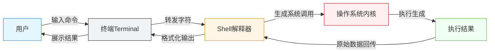

# 终端：那个黑窗口是什么

<div align="center">

**用文字操控电脑的工具**

`pwd` · `ls` · `cd` · `Tab` · `Ctrl+C`

</div>

## 前言

终端（Terminal）是一个没有按钮和图标的纯文本交互窗口，只有一个闪烁的光标和一个让你打字的地方。往窗口里输入命令，终端就会执行并返回结果。

> 你可能之前称之为“黑窗口”

<div id="interactive-terminal"></div>

<InteractiveTerminal />

本质上，用终端操控电脑和用鼠标点击图标操控电脑是**完全等价**的。在图形界面和 AI 时代到来之前，终端就是人类操控计算机的原生方式；即便到了今天，它依然是程序员不可或缺的核心工具。但对习惯了图形界面的人来说，那个黑窗口依然充满神秘感。

为什么我们的第一节内容就是终端？

<div class="outcome-grid">
  <div class="outcome-card">
    <span class="outcome-check">1</span>
    <div><strong>站在程序员视角看问题</strong><br>图形界面是为普通用户设计的。想和程序员一样去 Coding，终端是必须跨过的第一道门。</div>
  </div>
  <div class="outcome-card">
    <span class="outcome-check">2</span>
    <div><strong>终端是当下 AI 的原生接口</strong><br>大语言模型本身就是纯文本输入输出，终端与 AI Agent 天然适配。</div>
  </div>
</div>

当然，未来也可能发生变化。如果大模型发展到可以直接理解屏幕截图、读取屏幕输出并做出响应，人机交互方式可能会再次演变（现在已经有初步的趋势，比如 OpenClaw 这类 Agent 已经能解析截屏内容了）。到那个时候，也许人类、AI 与计算机的交互方式会统一。

## 开始使用
### 1. 打开终端

| 操作系统 | 怎么打开 |
|-----|---------|
| macOS（苹果电脑） | 按 `Cmd + 空格` 打开**聚焦搜索**，输入 `Terminal` 回车 |
| Windows | 按 `Win + R`，输入 `powershell` 回车 |
| Linux | 按 `Ctrl + Alt + T` |

打开后你会看到一个窗口，有一个光标在闪。这就是终端。

[↑ 回到前言，打开模拟终端试试 →](#interactive-terminal)

> **提示：** 在那个模拟终端里，`pwd`、`ls`、`cd`、`clear`、`mkdir`、`touch`、`cat`、`echo`、`rm` 都可以用，输入 `help` 还能看到全部可用命令。
> 随便试，不会弄坏任何东西！


### 2. 第一个命令：我在哪？

输入以下命令，然后按回车：

```bash
# macOS / Linux / Windows PowerShell 都一样
pwd
```

你会看到一行类似这样的输出：

```
/Users/yourname
```

恭喜你！你刚刚用文字问了电脑："我现在在哪个文件夹？"
电脑回答了你。

::: tip 💡 小提示
**pwd** = Print Working Directory（打印当前工作目录）

意思就是：告诉我，我现在在哪。
:::

### 3. 第二个命令：这里有什么？

```bash
# macOS / Linux
ls

# Windows PowerShell
dir
```

你会看到一长串名字，这些就是你当前所在文件夹里的东西。

想一想：这不就是你平时双击打开文件夹看到的东西吗？
只是现在用文字显示出来了而已。

::: tip 💡 小提示
**ls** = List（列出）

**dir** = Directory（目录/文件夹）
:::

### 4. 第三个命令：换个地方

假设你刚才用 `ls` 看到有个叫 `Documents` 的文件夹，
我们"走"进去看看：

```bash
# 所有系统都一样
cd Documents
```

看起来什么都没发生？但你已经"进去"了。
再输一次 `pwd` 看看，你会发现你的位置变了！

再输一次 `ls`（或 `dir`），你看到的东西也变了！

::: tip 💡 小提示
**cd** = Change Directory（切换目录）

就像你平时双击文件夹一样。
:::

### 5. 怎么回到上一级？

```bash
cd ..
```

没错，就是 `cd` 加两个点。这表示"回到上一级文件夹"。

### 终端小技巧

::: warning ⚠️ 强烈推荐
在继续之前，先教你三个能让你终端操作效率翻倍的小技巧：
:::

#### Tab 键自动补全

输入 `cd Doc`，然后按一下 `Tab` 键。
看！终端自动帮你补全成了 `cd Documents`！

- 按一次 `Tab`：自动补全（如果只有一个选项）
- 按两次 `Tab`：列出所有可能的选项（如果有多个选项）

**记住：`Tab` 是终端里用得最多的键。** 没有之一。善用它，你会少打很多字。

#### 上下方向键

试试按一下上箭头——你刚才输入的命令又出来了！

- 上箭头：回到上一条命令
- 下箭头：回到下一条命令

不用重复输入相同的命令，按几下就好。

#### Ctrl + C 紧急停止

输错了命令，或者命令跑起来停不下来了？

按 `Ctrl + C`（按住 Ctrl，再按 C）——任何时候都能救你！
> `Ctrl + C` 是终端的"紧急停止按钮"，不是复制。

## 原理简析

现在你已经会用三个命令了。很棒！
但你可能好奇：这个黑窗口到底是什么？

### 终端 = 用文字操控电脑

你平时用电脑，是这样的：

1. 双击文件夹 → 进去
2. 看看里面有什么 → 用眼睛扫一眼图标
3. 想回去 → 点"返回"按钮

你刚才用终端做的，**完全是同一件事**：

1. `cd Documents` = 双击 Documents 文件夹
2. `ls` = 看看文件夹里有什么
3. `cd ..` = 点返回

唯一的区别：一个用鼠标点，一个用文字输入。

### 为什么编程的时候用终端？

编程的时候，终端特别顺手，有几个原因：

- **可以批量操作**：你不可能用鼠标同时改名 100 个文件，但终端一句命令就能搞定
- **可以远程操作**：连到服务器上，只有终端，没有图形界面
- **AI 和工具都在这**：你用的 AI 编程工具、npm、Git，全都是终端里的命令

这不是说终端"比图形界面好"——你在终端的文件里找一张照片，当然是用 `Finder` 或者 `我的电脑` 预览更方便。它们是不同的工具，各有所长。

### Terminal vs Shell：到底是什么关系？

你可能在其他地方听过"Shell"这个词。
很多人会把 Terminal 和 Shell 混为一谈，但它们其实是两件不同的东西。

用一张图来说明：



用外卖打个比方：

| 角色 | 相当于 | 作用 |
|-----|--------|------|
| **Terminal** | 外卖 App 界面 | 你在这里输入地址，看到骑手反馈 |
| **Shell** | 外卖骑手 | 把你的需求传达给商家，把餐拿回来给你 |

**常见的 Shell 就像不同的骑手：**
- `bash` - 最经典的老骑手，哪里都有
- `zsh` - 更潮的骑手，功能多，macOS 默认用它
- `fish` - 颜值最高的骑手，自带各种酷炫功能
- `PowerShell` - Windows 专属的骑手

::: tip 🤔 留下一个问题
为什么要有这么多种 Shell？它们的区别真的重要吗？

这是个好问题。不同的 Shell 确实有不同的功能（比如更智能的自动补全、语法高亮、插件系统）。

**但对你现在来说，完全不重要。你可能根本感知不到 Shell 这一层。**
不管你用哪个 Shell，`pwd`、`ls`、`cd` 这些命令都是一样的。

等你学到需要配置终端、自定义快捷键的时候，我们再深入这个话题。
:::


## 避坑指南

新手用终端，很容易踩到这些坑：

### 坑 1：文件名有空格怎么办？

如果你要进一个叫 `My Project` 的文件夹：

❌ 错误：`cd My Project`（终端会以为你要进 `My`，后面是参数）

✅ 正确：用引号包起来 `cd "My Project"`

### 坑 2：输错了命令怎么办？

别慌！

- 按 `Ctrl + C` 取消当前输入
- 或者按 `Ctrl + U` 清空整行
- 重新输入就行

输错命令不会弄坏电脑——**终端是最安全的地方之一。**

### 坑 3：中文乱码？

偶尔会遇到中文显示成奇怪的符号。
这是编码问题，对你现在的学习影响不大。
遇到了先跳过，以后我们再讲怎么配置。


## 拓展阅读

### 还有哪些终端？

系统自带的终端够用了，但如果你想体验更好的终端，可以试试这些：

| 终端软件 | 适用系统 | 特点 | 推荐指数 | 链接 |
|---------|---------|------|---------|------|
| **macOS 自带 Terminal** | macOS | 开箱即用，无需安装 | ⭐⭐⭐ | — |
| **Windows 自带** | Windows | 包括 cmd 和 PowerShell | ⭐⭐⭐ | — |
| **iTerm2** | macOS | Mac 必备，功能强大，可高度自定义 | ⭐⭐⭐⭐⭐ | [GitHub](https://github.com/gnachman/iTerm2) |
| **Windows Terminal** | Windows | 微软官方出品，比老的 cmd 好看多了 | ⭐⭐⭐⭐ | [GitHub](https://github.com/microsoft/terminal) |
| **Hyper** | 全平台 | 用 Web 技术做的终端，颜值高，插件多 | ⭐⭐⭐⭐ | [GitHub](https://github.com/vercel/hyper) |
| **Warp** | macOS | 新兴 AI 终端，内置 AI 助手，超级炫酷 | ⭐⭐⭐⭐ | [官网](https://www.warp.dev) |
| **Alacritty** | 全平台 | 号称最快的终端，追求极致性能 | ⭐⭐⭐ | [GitHub](https://github.com/alacritty/alacritty) |

::: tip 💡 现在用哪个？**对你现在来说，用系统自带的就完全够用了。**

等你每天都要和终端打交道的时候，再去折腾这些花里胡哨的终端。到时候你会发现——原来终端也能这么好看！
:::

### 更多命令一览
你已经掌握了 3 个核心命令。其实终端里还有很多有意思的命令，我们先"剧透"一下——

<div class="tabs">
  <div class="tabs-nav">
    <div class="tabs-nav-item active" data-tab="mac">macOS / Linux</div>
    <div class="tabs-nav-item" data-tab="win">Windows PowerShell</div>
  </div>
  <div class="tabs-content">
    <div class="tabs-panel active" id="tab-mac">
      <table>
        <thead><tr><th>命令</th><th>作用</th><th>好奇心钩子</th></tr></thead>
        <tbody>
          <tr><td><code>clear</code></td><td>清屏</td><td>屏幕太乱了，想清空怎么办？</td></tr>
          <tr><td><code>touch hello.txt</code></td><td>创建文件</td><td>怎么在终端新建一个文件？</td></tr>
          <tr><td><code>mkdir my-folder</code></td><td>创建文件夹</td><td>怎么新建文件夹？</td></tr>
          <tr><td><code>cat hello.txt</code></td><td>查看文件内容</td><td>怎么不打开编辑器，直接看文件内容？</td></tr>
          <tr><td><code>rm hello.txt</code></td><td>删除文件</td><td>怎么删东西？（小心用！）</td></tr>
          <tr><td><code>cp a.txt b.txt</code></td><td>复制文件</td><td>怎么复制一份？</td></tr>
          <tr><td><code>mv a.txt c.txt</code></td><td>移动/重命名</td><td>怎么移动文件，或者改名字？</td></tr>
          <tr><td><code>echo "hello"</code></td><td>输出文字</td><td>怎么让终端"说话"？</td></tr>
        </tbody>
      </table>
    </div>
    <div class="tabs-panel" id="tab-win">
      <table>
        <thead><tr><th>命令</th><th>作用</th><th>好奇心钩子</th></tr></thead>
        <tbody>
          <tr><td><code>cls</code></td><td>清屏</td><td>屏幕太乱了，想清空怎么办？</td></tr>
          <tr><td><code>New-Item hello.txt</code></td><td>创建文件</td><td>怎么在终端新建一个文件？</td></tr>
          <tr><td><code>mkdir my-folder</code></td><td>创建文件夹</td><td>怎么新建文件夹？</td></tr>
          <tr><td><code>Get-Content hello.txt</code></td><td>查看文件内容</td><td>怎么不打开编辑器，直接看文件内容？</td></tr>
          <tr><td><code>Remove-Item hello.txt</code></td><td>删除文件</td><td>怎么删东西？（小心用！）</td></tr>
          <tr><td><code>Copy-Item a.txt b.txt</code></td><td>复制文件</td><td>怎么复制一份？</td></tr>
          <tr><td><code>Move-Item a.txt c.txt</code></td><td>移动/重命名</td><td>怎么移动文件，或者改名字？</td></tr>
          <tr><td><code>Write-Output "hello"</code></td><td>输出文字</td><td>怎么让终端"说话"？</td></tr>
        </tbody>
      </table>
    </div>
  </div>
</div>

::: tip 💡 **提示：** 这些命令我们会在后面的章节一一讲解。 
现在你可以试着输入 `clear`（Windows 是 `cls`）看看会发生什么——放心，不会弄坏电脑的。
:::

### 下一篇预告

至此，你已经能用终端在文件系统里穿梭了，这很棒！但你可能已经发现了——这些命令后面有时会跟着一些奇怪的东西，比如：

- `ls -l` 那个 `-l` 是什么？
- `cd ..` 里那两个点是什么意思？
- 为什么有些命令是 `命令 --help`，有些是 `命令 -h`？

这些，就是下一篇要讲的内容——**命令到底长什么样？**


## 术语表

| 术语 | 意思 |
|-----|------|
| **终端 (Terminal)** | 让你输入文字命令和电脑对话的窗口 |
| **命令 (Command)** | 你输入的符合特定规则的文字，电脑会解析并执行它，产生某些效果（例如新建文件夹） |
| **Shell** | 真正解释和执行命令的程序，终端只是它的"门面" |
| **目录 (Directory)** | 就是"文件夹"的另一种说法 |
| **路径 (Path)** | 描述一个文件或文件夹位置的文字（如 `/Users/yourname/Documents`） |
| **pwd** | Print Working Directory，打印当前所在位置 |
| **ls（或 dir）** | 列出当前目录的内容 |
| **cd** | Change Directory，切换目录 |
| **Tab 补全** | 按 Tab 键自动补全命令或文件名，减少打字 |
