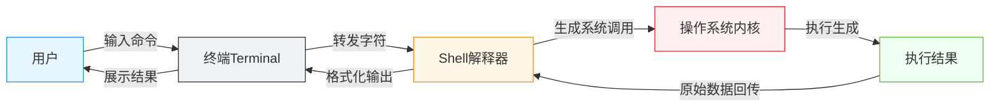

# 终端：那个黑窗口是什么

<div align="center">

**用文字操控电脑的工具**

`pwd` · `ls` · `cd` · `Tab` · `Ctrl+C`

</div>

## 前言

终端（Terminal）是操作系统提供的一种文本交互界面：用户通过键盘输入命令，系统执行后以文本形式返回结果。与图形界面（GUI）不同，终端没有按钮或图标，仅由一个输入光标与字符输出构成。

::: tip 💡 你可能之前称之为"黑窗口"
终端窗口通常为深色背景、纯文本输出，因此常被俗称为"黑窗口"。
:::

<div id="interactive-terminal"></div>

<InteractiveTerminal />

在功能上，终端与图形界面是**等价**的：两者都是人类向计算机下达指令的方式，区别仅在于交互媒介（文本命令 vs 鼠标点击）。在图形界面与 AI 时代到来之前，终端是人类操控计算机的原生方式；至今，它仍是程序员的核心工具。图形界面面向普通用户设计，而终端更贴近计算机的实际工作方式，这也是把它作为课程起点的原因。

<div class="outcome-grid">
  <div class="outcome-card">
    <span class="outcome-check">1</span>
    <div><strong>站在程序员视角看问题</strong><br>图形界面是为普通用户设计的。要像程序员一样 Coding，终端是必须跨过的第一道门。</div>
  </div>
  <div class="outcome-card">
    <span class="outcome-check">2</span>
    <div><strong>终端是当下 AI 的原生接口</strong><br>大语言模型以纯文本输入输出，终端与 AI Agent 天然适配。</div>
  </div>
</div>

未来人机交互可能随多模态模型的发展而演变（如 Agent 直接解析屏幕截图，OpenClaw 等已有初步实践），届时终端的重要性可能重新定义，但文本指令仍是当前最稳定的接口。

## 开始使用

### 1. 打开终端

| 操作系统 | 打开方式 |
|-----|---------|
| macOS | 按 `Cmd + 空格` 打开聚焦搜索，输入 `Terminal` 回车 |
| Windows | 按 `Win + R`，输入 `powershell` 回车 |
| Linux | 按 `Ctrl + Alt + T` |

打开后即进入终端界面，光标闪烁处即为命令输入位置。

[↑ 回到前言，打开模拟终端试试 →](#interactive-terminal)

::: tip 💡 提示
模拟终端支持 `pwd`、`ls`、`cd`、`clear`、`mkdir`、`touch`、`cat`、`echo`、`rm`，输入 `help` 可查看全部可用命令。可放心尝试，不会影响真实系统。
:::

### 2. 第一个命令：查看当前工作目录

```bash
# macOS / Linux / Windows PowerShell 通用
pwd
```

输出示例：

```
/Users/yourname
```

`pwd`（Print Working Directory）输出 Shell 当前的工作目录（Working Directory），即命令执行时所在的目录。

::: tip 💡 小提示
**pwd** = Print Working Directory（打印当前工作目录），即"告诉我，我现在在哪"。
:::

### 3. 第二个命令：列出目录内容

```bash
# macOS / Linux
ls

# Windows PowerShell
dir
```

`ls`（List）列出当前工作目录下的条目（文件与子目录）；Windows PowerShell 中对应命令为 `dir`。

::: tip 💡 小提示
`ls` 的输出等同于图形界面中"打开文件夹看到的内容"，只是以文本形式呈现。
:::

### 4. 第三个命令：切换工作目录

```bash
# 所有系统一致
cd Documents
```

`cd`（Change Directory）将 Shell 的工作目录切换为指定路径。切换后，`pwd` 与 `ls` 的输出会随之变化。

::: tip 💡 小提示
`cd` 就相当于在图形界面中双击进入文件夹。
:::

### 5. 返回上级目录

```bash
cd ..
```

`..` 是路径语法中对父目录的引用；`cd ..` 即切换到当前目录的上一级。

### 终端小技巧

::: warning ⚠️ 强烈推荐
在继续之前，先掌握三个能显著提升终端操作效率的小技巧：
:::

#### Tab 键自动补全

输入 `cd Doc` 后按 `Tab`，终端会自动补全为 `cd Documents`。

- 按一次 `Tab`：自动补全（仅一个候选时）
- 按两次 `Tab`：列出所有候选

Tab 补全是终端中使用频率最高的效率手段，可显著减少键盘输入。

#### 上下方向键

- 上箭头：调出上一条命令
- 下箭头：调出下一条命令

Shell 会保存历史命令，方向键可避免重复输入。

#### Ctrl + C 终止

`Ctrl + C` 向前台进程发送中断信号（SIGINT），终止当前正在执行的命令或输入。

::: warning ⚠️ 注意
`Ctrl + C` 是"终止"，不是复制。
:::

## 原理简析

### 终端与图形界面的等价性

图形界面中的常见操作均可由终端命令等价完成：

| 图形界面操作 | 终端命令 |
|------|---------|
| 双击进入文件夹 | `cd <目录>` |
| 查看文件夹内容 | `ls` |
| 返回上级 | `cd ..` |

两者的区别仅在于交互方式：GUI 用鼠标点击，终端用文本输入。终端的长处在于可批量、可远程、可脚本化：

- **批量操作**：一条命令可同时处理大量文件（如批量改名）
- **远程操作**：服务器通常只有命令行接口，没有图形界面
- **工具生态**：AI 编程工具、npm、Git 均以命令行为接口

::: tip 💡 补充说明
终端并不"优于"图形界面，两者各有所长：预览图片用 Finder 或资源管理器更直观，精确的批量操作则适合终端。它们是不同场景下的工具。
:::

### Terminal 与 Shell

终端与 Shell 是两层不同的程序，常被混为一谈：

- **终端（Terminal）**：负责字符的输入输出与展示，是用户交互的载体
- **Shell**：命令解释器，解析命令、生成系统调用并返回结果



::: tip 🛵 打个比方
可以把终端理解为"外卖 App 界面"，Shell 是"骑手"：你在界面上输入需求，骑手负责转达并取回结果。
:::

**常见 Shell：**

| Shell | 说明 |
|-------|------|
| `bash` | 最经典、最通用的 Shell，几乎所有 Unix 系系统自带 |
| `zsh` | 功能更丰富，macOS 默认 Shell |
| `fish` | 交互体验出色的现代 Shell，内置语法高亮与补全 |
| `PowerShell` | Windows 原生 Shell |

::: tip 🤔 需要关心 Shell 的区别吗？
不同 Shell 在补全、语法高亮、脚本语法上确有差异，但对初学者来说，`pwd`、`ls`、`cd` 等核心命令在各 Shell 下语义一致。等到需要配置终端、自定义快捷键时，再深入这个话题即可。
:::

## 避坑指南

### 坑 1：文件名含空格

`cd My Project` 会被解析为进入目录 `My`，并将 `Project` 视为额外参数。需用引号包裹：

```bash
cd "My Project"
```

### 坑 2：输入错误命令

- 按 `Ctrl + C` 取消当前输入 / 终止进程
- 按 `Ctrl + U` 清空整行
- 重新输入即可

::: tip 💡 放心
终端是最安全的地方之一：输入错误命令不会损坏系统，大多数危险操作（如删除）需要显式指定路径才生效。
:::

### 坑 3：中文乱码

终端偶发中文乱码属于字符编码问题，通常不影响命令执行，当前阶段可跳过，后续章节再说明配置方法。

## 拓展阅读

### 推荐终端

系统自带终端已可满足日常使用，如需更好的体验可参考：

| 终端软件 | 适用系统 | 特点 | 推荐指数 | 链接 |
|---------|---------|------|---------|------|
| **macOS 自带 Terminal** | macOS | 开箱即用，无需安装 | ⭐⭐⭐ | — |
| **Windows 自带** | Windows | 包括 cmd 和 PowerShell | ⭐⭐⭐ | — |
| **iTerm2** | macOS | 功能强大，可高度自定义 | ⭐⭐⭐⭐⭐ | [GitHub](https://github.com/gnachman/iTerm2) |
| **Windows Terminal** | Windows | 微软官方出品，体验优于旧版 cmd | ⭐⭐⭐⭐ | [GitHub](https://github.com/microsoft/terminal) |
| **Hyper** | 全平台 | 基于 Web 技术，颜值高、插件多 | ⭐⭐⭐⭐ | [GitHub](https://github.com/vercel/hyper) |
| **Warp** | macOS | 内置 AI 助手的现代终端 | ⭐⭐⭐⭐ | [官网](https://www.warp.dev) |
| **Alacritty** | 全平台 | 以性能著称，GPU 加速渲染 | ⭐⭐⭐ | [GitHub](https://github.com/alacritty/alacritty) |

::: tip 💡 现在用哪个？
对现阶段来说，系统自带的终端完全够用。等每天高频使用终端后，再去探索功能更丰富的选择。
:::

### 更多命令一览

前面已掌握 3 个核心命令。终端能力远不止于此，下面是新手最常用的一批命令，已按 macOS/Linux 与 Windows PowerShell 双栏对照：

<div class="tabs">
  <div class="tabs-nav">
    <div class="tabs-nav-item active" data-tab="mac">macOS / Linux</div>
    <div class="tabs-nav-item" data-tab="win">Windows PowerShell</div>
  </div>
  <div class="tabs-content">
    <div class="tabs-panel active" id="tab-mac">
      <table>
        <thead><tr><th>命令</th><th>作用</th><th>高频用法</th></tr></thead>
        <tbody>
          <tr><td><code>clear</code></td><td>清空屏幕</td><td><code>clear</code></td></tr>
          <tr><td><code>echo</code></td><td>输出文本</td><td><code>echo "hello"</code></td></tr>
          <tr><td><code>man</code></td><td>查看命令手册</td><td><code>man ls</code></td></tr>
          <tr><td><code>--help</code></td><td>查看命令用法摘要</td><td><code>ls --help</code></td></tr>
          <tr><td><code>history</code></td><td>查看历史命令</td><td><code>history</code></td></tr>
          <tr><td><code>touch</code></td><td>创建空文件</td><td><code>touch hello.txt</code></td></tr>
          <tr><td><code>mkdir</code></td><td>创建目录</td><td><code>mkdir my-folder</code></td></tr>
          <tr><td><code>cat</code></td><td>查看文件内容</td><td><code>cat hello.txt</code></td></tr>
          <tr><td><code>head</code></td><td>查看文件开头若干行</td><td><code>head -n 10 hello.txt</code></td></tr>
          <tr><td><code>tail</code></td><td>查看文件末尾若干行</td><td><code>tail -n 10 hello.txt</code></td></tr>
          <tr><td><code>grep</code></td><td>按模式检索文本</td><td><code>grep "error" log.txt</code></td></tr>
          <tr><td><code>find</code></td><td>按条件查找文件</td><td><code>find . -name "*.md"</code></td></tr>
          <tr><td><code>cp</code></td><td>复制文件/目录</td><td><code>cp -r src dst</code></td></tr>
          <tr><td><code>mv</code></td><td>移动/重命名</td><td><code>mv a.txt b.txt</code></td></tr>
          <tr><td><code>rm</code></td><td>删除文件/目录</td><td><code>rm -r my-folder</code></td></tr>
          <tr><td><code>|</code></td><td>管道：前一命令的输出作为后一命令输入</td><td><code>ls | grep md</code></td></tr>
          <tr><td><code>&gt;</code></td><td>重定向：输出写入文件</td><td><code>echo "hi" &gt; a.txt</code></td></tr>
          <tr><td><code>curl</code></td><td>发起网络请求</td><td><code>curl https://example.com</code></td></tr>
        </tbody>
      </table>
    </div>
    <div class="tabs-panel" id="tab-win">
      <table>
        <thead><tr><th>命令</th><th>作用</th><th>高频用法</th></tr></thead>
        <tbody>
          <tr><td><code>cls</code></td><td>清空屏幕</td><td><code>cls</code></td></tr>
          <tr><td><code>Write-Output</code></td><td>输出文本</td><td><code>Write-Output "hello"</code></td></tr>
          <tr><td><code>Get-Help</code></td><td>查看命令帮助</td><td><code>Get-Help Get-ChildItem</code></td></tr>
          <tr><td><code>-?</code></td><td>查看命令用法摘要</td><td><code>Get-ChildItem -?</code></td></tr>
          <tr><td><code>Get-History</code></td><td>查看历史命令</td><td><code>Get-History</code></td></tr>
          <tr><td><code>New-Item</code></td><td>创建空文件</td><td><code>New-Item hello.txt</code></td></tr>
          <tr><td><code>mkdir</code></td><td>创建目录</td><td><code>mkdir my-folder</code></td></tr>
          <tr><td><code>Get-Content</code></td><td>查看文件内容</td><td><code>Get-Content hello.txt</code></td></tr>
          <tr><td><code>Get-Content</code></td><td>查看文件开头若干行</td><td><code>Get-Content hello.txt -TotalCount 10</code></td></tr>
          <tr><td><code>Get-Content</code></td><td>查看文件末尾若干行</td><td><code>Get-Content hello.txt -Tail 10</code></td></tr>
          <tr><td><code>Select-String</code></td><td>按模式检索文本</td><td><code>Select-String "error" log.txt</code></td></tr>
          <tr><td><code>Get-ChildItem</code></td><td>按条件查找文件</td><td><code>Get-ChildItem -Recurse -Filter *.md</code></td></tr>
          <tr><td><code>Copy-Item</code></td><td>复制文件/目录</td><td><code>Copy-Item -Recurse src dst</code></td></tr>
          <tr><td><code>Move-Item</code></td><td>移动/重命名</td><td><code>Move-Item a.txt b.txt</code></td></tr>
          <tr><td><code>Remove-Item</code></td><td>删除文件/目录</td><td><code>Remove-Item -Recurse my-folder</code></td></tr>
          <tr><td><code>|</code></td><td>管道：前一命令的输出作为后一命令输入</td><td><code>Get-ChildItem | Select-String md</code></td></tr>
          <tr><td><code>&gt;</code></td><td>重定向：输出写入文件</td><td><code>"hi" | Out-File a.txt</code></td></tr>
          <tr><td><code>Invoke-WebRequest</code></td><td>发起网络请求</td><td><code>Invoke-WebRequest https://example.com</code></td></tr>
        </tbody>
      </table>
    </div>
  </div>
</div>

::: warning ⚠️ 注意
`rm` / `Remove-Item` 删除操作不可恢复，加 `-r` / `-Recurse` 递归删除时务必确认目标。
:::

::: tip 💡 **提示：** 以上命令会在后续章节逐一讲解。
现在可以先试试 `clear`（Windows 为 `cls`）清屏，或 `ls | grep md` 组合管道——放心，不会弄坏电脑。
:::

### 下一篇预告

命令后面常跟选项与参数，例如 `ls -l` 中的 `-l`、`cd ..` 中的 `..`，以及 `--help` 与 `-h` 的区别。下一篇将讲解命令的结构。

## 术语表

| 术语 | 意思 |
|-----|------|
| **终端 (Terminal)** | 以文本方式输入命令、接收输出的交互界面 |
| **命令 (Command)** | 符合特定语法的文本指令，由 Shell 解析执行并产生效果 |
| **Shell** | 真正解释并执行命令的程序，终端只是其交互载体 |
| **工作目录 (Working Directory)** | Shell 当前所处的位置，`pwd` 可查看 |
| **目录 (Directory)** | 文件系统中的一个容器，即"文件夹" |
| **路径 (Path)** | 描述文件或目录位置的字符串，如 `/Users/yourname/Documents` |
| **pwd** | Print Working Directory，打印当前工作目录 |
| **ls（或 dir）** | 列出当前目录的内容 |
| **cd** | Change Directory，切换工作目录 |
| **管道 (Pipe)** | 用 `|` 将一个命令的输出作为另一命令的输入 |
| **重定向 (Redirection)** | 用 `>` 将命令输出写入文件 |
| **Tab 补全** | 按 Tab 键自动补全命令或文件名 |
