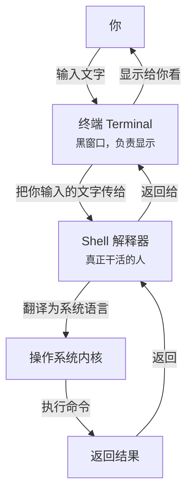

# 终端基础

AI 对你说：*"打开终端，cd 到你的项目目录，然后运行 npm install"*

你：*"什么是终端？什么是 cd？目录又是什么意思？"*

几乎每一个 vibecoding 项目的第一步，都是从打开终端开始的。
但对于很多人来说，那个黑窗口充满了神秘感。

别担心，它只是一个**用文字和电脑对话的工具**而已。

## 🎯 实战：认识终端

### 1. 打开终端

| 系统 | 怎么打开 |
|-----|---------|
| macOS | 按 `Cmd + 空格` 打开 Spotlight，输入 `Terminal` 回车 |
| Windows | 按 `Win + R`，输入 `powershell` 回车 |
| Linux | 按 `Ctrl + Alt + T` |

打开后你会看到一个黑（或白）窗口，有一个光标在闪。这就是终端。

### 2. 第一个命令：我在哪？

输入以下命令，然后按回车：

```bash
# macOS / Linux
pwd

# Windows PowerShell
pwd
```

你会看到一行类似这样的输出：

```
/Users/yourname
```

恭喜你！你刚刚用文字问了电脑："我现在在哪个文件夹？"
电脑回答了你。

::: tip 💡 小提示
**pwd** = Print Working Directory（打印当前工作目录）

意思就是：告诉我，我现在在哪。
:::

### 3. 第二个命令：这里有什么？

输入以下命令，按回车：

```bash
# macOS / Linux
ls

# Windows PowerShell
dir
```

你会看到一长串名字——这些就是你当前所在文件夹里的东西。

想一想：这不就是你平时双击打开文件夹看到的东西吗？
只是现在用文字显示出来了而已。

::: tip 💡 小提示
**ls** = List（列出）

**dir** = Directory（目录/文件夹）
:::

### 4. 第三个命令：换个地方

假设你刚才用 `ls` 看到有个叫 `Documents` 的文件夹，
我们"走"进去看看：

```bash
# 所有系统都一样
cd Documents
```

看起来什么都没发生？但你已经"进去"了。
再输一次 `pwd` 看看——你的位置变了！

再输一次 `ls`（或 `dir`）——你看到的东西也变了！

::: tip 💡 小提示
**cd** = Change Directory（切换目录）

就像你平时双击文件夹一样。
:::

### 怎么回到上一级？

```bash
cd ..
```

没错，就是 `cd` 加两个点。这表示"回到上一级文件夹"。

### 🔥 三个必知的终端小技巧

在继续之前，先教你三个能让你终端操作效率翻倍的小技巧：

#### 1. Tab 键自动补全 ✨

输入 `cd Doc`，然后按一下 `Tab` 键——
看！终端自动帮你补全成了 `cd Documents`！

- 按一次 `Tab`：自动补全（如果只有一个选项）
- 按两次 `Tab`：列出所有可能的选项（如果有多个选项）

**记住：`Tab` 是终端里用得最多的键。** 没有之一。善用它，你会少打很多字。

#### 2. 上下方向键 ↕

试试按一下上箭头——你刚才输入的命令又出来了！

- 上箭头：回到上一条命令
- 下箭头：回到下一条命令

不用重复输入相同的命令，按几下就好。

#### 3. Ctrl + C 紧急停止 🛑

输错了命令，或者命令跑起来停不下来了？

按 `Ctrl + C`（按住 Ctrl，再按 C）——**任何时候都能救你！

::: warning ⚠️ 这三个技巧太重要了
`Ctrl + C` 是终端的"紧急停止按钮"。
不管发生什么情况，按了就没事了。
:::

---

## 🎮 实战小项目：用终端找到你的项目

学完这三个命令，你已经可以解决 vibecoding 中最常见的一个问题了！

**场景：** AI 跟你说"cd 到你的项目目录"

**任务：** 用终端找到你刚才让 AI 生成的项目文件夹

**步骤：**

1. 打开终端
2. 输入 `pwd`，看看你现在在哪
3. 输入 `ls`，看看当前文件夹里有什么
4. 项目一般在"桌面"或"下载"文件夹里：
   - 试试 `cd Desktop`（桌面）
   - 或者 `cd Downloads`（下载）
5. 再 `ls` 一下，你是不是看到了项目文件夹？
6. `cd 项目文件夹名`，进去看看
7. 骄傲地说：**"我找到项目目录了！"**

::: tip ✅ 完成这个小任务，你就掌握了程序员 80% 的终端操作
信不信由你，很多程序员每天的终端操作就是反复 `cd` 和 `ls`。
剩下的 20%，我们慢慢学。
:::

---

## 🧩 底层揭秘：终端到底是什么？

现在你已经会用三个命令了。很棒！
但你可能好奇：这个黑窗口到底是什么？

### 终端 = 文字版的文件管理器

想一下你平时怎么用电脑：

1. 双击文件夹进去
2. 看看里面有什么
3. 想回去就点"返回"

你刚才用终端做的，**完全是同一件事**：

1. `cd Documents` = 双击 Documents 文件夹
2. `ls` = 看看文件夹里有什么
3. `cd ..` = 点返回

唯一的区别：一个用鼠标点，一个用文字输入。

### 为什么要用文字？

既然鼠标这么方便，为什么程序员们还要用文字？

因为：

- **精确**：你说"进 Documents 文件夹"，它就精确地进去。不会点错。
- **可重复**：同样的命令可以写成脚本，自动运行一百次、一万次。
- **可描述**：你可以轻松跟别人（或 AI）说"cd 到 Documents"，
  但很难描述"你在窗口里找到那个蓝色的文件夹图标然后双击它"。

### Terminal vs Shell：到底是什么关系？

你可能在其他地方听过"Shell"这个词。
很多人会把 Terminal 和 Shell 混为一谈，但它们其实是两件不同的东西。

用一张图来说明：



用外卖打个比方：

| 角色 | 相当于 | 作用 |
|-----|--------|------|
| **Terminal** | 外卖 App 界面 | 你在这里输入地址，看到骑手反馈 |
| **Shell** | 外卖骑手 | 把你的需求传达给商家，把餐拿回来给你 |

**常见的 Shell 就像不同的骑手：**
- `bash` - 最经典的老骑手，哪里都有
- `zsh` - 更潮的骑手，功能多，macOS 默认用它
- `fish` - 颜值最高的骑手，自带各种酷炫功能
- `PowerShell` - Windows 专属的骑手

::: tip 🤔 留下一个问题
为什么要有这么多种 Shell？它们的区别真的重要吗？

这是个好问题。不同的 Shell 确实有不同的功能（比如更智能的自动补全、语法高亮、插件系统）。

**但对你现在来说，完全不重要。**
不管你用哪个 Shell，`pwd`、`ls`、`cd` 这些命令都是一样的。

等你学到需要配置终端、自定义快捷键的时候，我们再深入这个话题。
:::

---

## 💻 有什么好用的终端？

系统自带的终端够用了，但如果你想体验更好的终端，可以试试这些：

| 终端软件 | 适用系统 | 特点 | 推荐指数 |
|---------|---------|------|---------|
| **系统自带 Terminal** | 全平台 | 不用装，开箱即用 | ⭐⭐⭐ |
| **iTerm2** | macOS | Mac 必备，功能强大，可高度自定义 | ⭐⭐⭐⭐⭐ |
| **Windows Terminal** | Windows | 微软官方出品，比老的 cmd 好看多了 | ⭐⭐⭐⭐ |
| **Hyper** | 全平台 | 用 Web 技术做的终端，颜值高，插件多 | ⭐⭐⭐⭐ |
| **Warp** | macOS | 新兴 AI 终端，内置 AI 助手，超级炫酷 | ⭐⭐⭐⭐ |
| **Alacritty** | 全平台 | 号称最快的终端，追求极致性能 | ⭐⭐⭐ |

::: tip 💡 现在用哪个？
**对你现在来说，用系统自带的就完全够用了。**

等你每天都要和终端打交道的时候，再去折腾这些花里胡哨的终端。
到时候你会发现——原来终端也能这么好看！
:::

---

## ⚠️ 常见坑与避坑指南

新手用终端，很容易踩到这些坑：

### 坑 1：文件名有空格怎么办？

如果你要进一个叫 `My Project` 的文件夹：

❌ 错误：`cd My Project`（终端会以为你要进 `My`，后面是参数）

✅ 正确：用引号包起来 `cd "My Project"`

### 坑 2：输错了命令怎么办？

别慌！

- 按 `Ctrl + C` 取消当前输入
- 或者按 `Ctrl + U` 清空整行
- 重新输入就行

输错命令不会弄坏电脑——**终端是最安全的地方之一。**

### 坑 3：中文乱码？

偶尔会遇到中文显示成奇怪的符号。
这是编码问题，对你现在的学习影响不大。
遇到了先跳过，以后我们再讲怎么配置。

---

## 🚀 进阶探索：更多有意思的命令

你已经掌握了 3 个核心命令。
其实终端里还有很多有意思的命令，我们先"剧透"一下——

::: details 点击展开，看看还有哪些命令 👀

<div class="tabs">
  <div class="tabs-nav">
    <div class="tabs-nav-item active" data-tab="mac">macOS / Linux</div>
    <div class="tabs-nav-item" data-tab="win">Windows PowerShell</div>
  </div>
  <div class="tabs-content">
    <div class="tabs-panel active" id="tab-mac">
      | 命令 | 作用 | 好奇心钩子 ❓ |
      |-----|------|--------------|
      | `clear` | 清屏 | 屏幕太乱了，想清空怎么办？ |
      | `touch hello.txt` | 创建文件 | 怎么在终端新建一个文件？ |
      | `mkdir my-folder` | 创建文件夹 | 怎么新建文件夹？ |
      | `cat hello.txt` | 查看文件内容 | 怎么不打开编辑器，直接看文件内容？ |
      | `rm hello.txt` | 删除文件 | 怎么删东西？（小心用！） |
      | `cp a.txt b.txt` | 复制文件 | 怎么复制一份？ |
      | `mv a.txt c.txt` | 移动/重命名 | 怎么移动文件，或者改名字？ |
      | `echo "hello"` | 输出文字 | 怎么让终端"说话"？ |
    </div>
    <div class="tabs-panel" id="tab-win">
      | 命令 | 作用 | 好奇心钩子 ❓ |
      |-----|------|--------------|
      | `cls` | 清屏 | 屏幕太乱了，想清空怎么办？ |
      | `New-Item hello.txt` | 创建文件 | 怎么在终端新建一个文件？ |
      | `mkdir my-folder` | 创建文件夹 | 怎么新建文件夹？ |
      | `Get-Content hello.txt` | 查看文件内容 | 怎么不打开编辑器，直接看文件内容？ |
      | `Remove-Item hello.txt` | 删除文件 | 怎么删东西？（小心用！） |
      | `Copy-Item a.txt b.txt` | 复制文件 | 怎么复制一份？ |
      | `Move-Item a.txt c.txt` | 移动/重命名 | 怎么移动文件，或者改名字？ |
      | `Write-Output "hello"` | 输出文字 | 怎么让终端"说话"？ |
    </div>
  </div>
</div>

:::

💡 **提示：** 这些命令我们会在后面的章节一一讲解。
现在你可以试着输入 `clear`（Windows 是 `cls`）看看会发生什么——放心，不会弄坏电脑的。

---

## 🤔 然后呢？

你已经能用终端在文件系统里穿梭了，这很棒！

但你可能已经产生了新的疑问：

- ❓ 为什么路径要用斜杠？
- ❓ `/Users/name` 和 `../folder` 有什么区别？
- ❓ 为什么文件名后面要有奇怪的后缀（比如 `.txt`、`.md`、`.js`）？
- ❓ 如果我输错了命令，会怎么样？

这些问题，我们在下一章《文件系统与路径》里一一解答。

---

## 📝 术语表

| 术语 | 意思 |
|-----|------|
| **终端 (Terminal)** | 让你输入文字命令和电脑对话的窗口 |
| **Shell** | 真正解释和执行命令的程序（终端是壳，Shell 是核） |
| **命令 (Command)** | 你输入的文字，电脑会执行它 |
| **目录 (Directory)** | 就是"文件夹"的另一种说法 |
| **路径 (Path)** | 描述一个文件或文件夹位置的文字（如 `/Users/yourname/Documents`） |
| **pwd** | 打印当前位置 |
| **ls / dir** | 列出当前目录的内容 |
| **cd** | 切换目录 |

---

上一篇：[不知道从哪开始？](../start-here)

下一篇：[文件系统](./03-file-system)