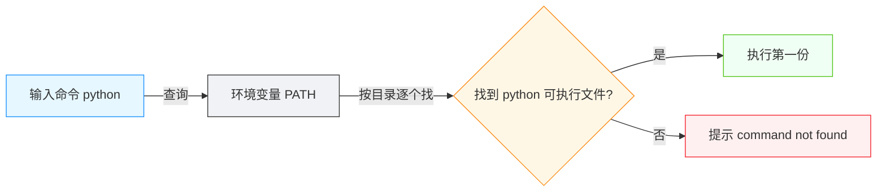

# 环境：装个环境为什么这么难

<div align="center">

**运行代码之前，先配好的一整套软件**

语言 · 运行时 · 包管理器 · 环境隔离

</div>

## 前言

> 💡 **场景重现**
>
> AI 对你说："先把环境配好，然后 `npm install`，再 `npm run dev`"
>
> 你："什么是环境？装了一下午，怎么还在报错？"

如果你让一位计算机系的学生帮你配环境，他大概率会露出痛苦的表情。装 Java 要配 PATH，装 Python 发现有"两个"，`gcc` 报找不到，`node` 版本和项目对不上——一个晚上都在跟这些报错搏斗，代码一行还没写。好在 AI 出现了，他们终于可以从"兼职环境工程师"的岗位上解放出来。

本篇围绕"环境"（Environment）这个词展开，讲清楚它到底指什么、由哪些部分组成，以及为什么"配环境"曾经如此痛苦。这是你后续处理各种安装报错的地图。

::: tip 💡 一句话记住环境
**环境** = 为了让一套程序能跑起来，你需要提前准备好的一整套软件：语言本身、运行时、包管理器、第三方依赖、以及相关配置。它不是某一个程序，而是"一整套东西"。
:::

## 什么是"环境"

程序不是凭空运行起来的。一份代码写好之后，要真正"跑起来"，中间隔着整整一层软件。这一层软件，就是**环境**。

打个比方：房子（代码）有了，还得通上水电（运行时）、装好水管（依赖）、调好燃气（配置），才能住人。这套"入住前要准备好的基础设施"，就是开发环境。

环境的组成可以拆成三样核心的东西，理解了它们，几乎所有"配环境"的场景都能对上号：

- **语言**（Programming Language）：你写代码所遵循的语法规则本身，如 JavaScript、Python、Java
- **运行时**（Runtime）：真正负责把代码"跑起来"的程序，如 Node.js、Python 解释器、JVM
- **包管理器**（Package Manager）：负责下载、安装、管理第三方库的工具，如 npm、pip、Maven

::: tip 💡 通俗类比
- **语言** = 语法规则：像英语的语法，规定句子怎么写
- **运行时** = 执行的人：把符合语法的内容真正"说出来/做出来"
- **包管理器** = 采购员：把别人写好的现成零件买回来、装好、供你使用
:::

::: tip ⚠️ 注意
语言、运行时、包管理器是三个不同的概念，但日常聊天里经常混着说："配 Python 环境"往往既指装解释器，也指装 pip。心里分清这三层，看报错和文档时就不会晕。
:::

## 语言 / 运行时 / 包管理器：一张对照表

不同语言，这"三件套"各不一样。项目是哪种语言，你就要配哪一套环境。下表是主流语言最常见的默认组合：

| 语言 | 运行时 | 包管理器 | 配环境时最常见的坑 |
|------|--------|---------|------------------|
| JavaScript | Node.js | npm（另有 yarn、pnpm） | Node 版本与项目要求不兼容 |
| Python | Python 解释器 | pip / conda / uv | 机器上有"两个 Python" |
| Java | JVM（Java 虚拟机） | Maven / Gradle | JDK 版本与项目要求不符 |
| Go | Go 工具链 | go mod | 工具链版本落后 |
| Rust | rustc 编译器 | Cargo | 依赖编译链不完整 |
| C / C++ | 编译器（gcc / clang） | make / CMake、系统包管理器（apt / Homebrew） | 编译时提示 `gcc: command not found` |

::: tip 💡 抓住骨架
这张表不用背。要点只有一个：**每个语言 = 语言 + 运行时 + 包管理器 的三层骨架**。换一种语言，只是把三层各换成对应工具而已。
:::

::: tip 💡 运行时到底是个啥
"运行时"（Runtime，有时也叫"运行环境"）这个名字容易劝退，其实就是**负责把代码真正跑起来的那个程序**，很具体：
- **JavaScript**：浏览器里的 JS 由浏览器执行；想在命令行里跑 JS 项目，就得装 Node.js——它就是 JavaScript 在浏览器之外的运行时
- **Python**：安装的"Python"本身既是解释器也是运行时，`python xxx.py` 就是用运行时去执行脚本
- **Java**：代码先编译成字节码，再由 JVM（Java 虚拟机，负责执行 Java 程序的那层虚拟机）逐条执行，JVM 就是 Java 的运行时

版本命令输出的 `v20.10.0`、`Python 3.12.1`，报的正是运行时的版本号。
:::

## 实战：检查你机器上的环境

配环境的第一步，是先知道机器上已经装了什么。几乎所有运行时和包管理器都支持版本查询命令，输出一个版本号：

```bash
# macOS / Linux / Windows PowerShell 通用
node --version
python --version
java -version
```

输出形如：

```
v20.10.0
Python 3.12.1
openjdk version "17.0.9" ...
```

查看包管理器的版本：

```bash
# macOS / Linux / Windows PowerShell 通用
npm --version
pip --version
```

::: tip 💡 `--version` 是什么
`--version` 是大多数命令行工具支持的通用选项，作用就是"告诉我你是什么版本"。
:::

如果想知道某个程序"装在哪儿"，可以用定位命令：

```bash
# macOS / Linux
which node

# Windows PowerShell
Get-Command node
```

输出是程序的安装路径。报"找不到"时，这个命令能帮你确认是"真没装"还是"装了但系统找不到"——后者的原因在下一节"原理简析"中解释。

::: tip 💡 试试你的机器
在终端里依次输入上面的版本命令。能输出版本号的，说明对应环境已存在；提示"command not found"（找不到命令）的，说明还没配好。这正好是后面章节要解决的场景。
:::

::: warning ⚠️ Windows 上小心"假 Python"
Windows 上输入 `python` 有时会弹出微软商店（Microsoft Store）的安装页面，而不是进入 Python。这是系统内置的"快捷方式"在拦截，实际 Python 并未装好。请从 Python 官网下载安装，并勾选"Add python to PATH"（把 Python 加入 PATH，见下文）。
:::

## 原理简析：为什么配环境这么痛苦

了解了"三件套"，现在回答文章开头的问题：配环境为什么这么痛苦？根本原因有两个——**版本多** 与 **全局乱**。

### 原因 1：每个项目要的版本不一样

同一门语言，不同项目可能要求不同的运行时版本：项目 A 要求 Node 18，项目 B 要 Node 20。而大多数工具默认把运行时装在一个"系统级"位置，所有项目共用一份。要同时满足两个项目，就得来回切换，切换错了就报版本不兼容。

### 原因 2：同名程序可以装很多份

电脑上可能同时存在多个同名程序：两个 Python（比如一个来自官网、一个来自 Anaconda）、多份 Node（不同版本）。这时命令行输入 `python`，到底执行的是哪一份？这取决于命令解释器查找命令的方式。

#### PATH：命令是怎么被找到的

命令解释器执行命令时，并不是全盘搜索整个硬盘，而是按照**PATH**（环境变量，即"操作系统保存的一组目录路径"）中登记的顺序，逐个目录查找可执行文件。



所以"`gcc: command not found`"往往不是 gcc 没装，而是**装了，但没装进 PATH 能找到的位置**（或 PATH 里没登记）。查看当前 PATH：

```bash
# macOS / Linux
echo $PATH

# Windows PowerShell
$env:PATH
```

输出是一长串以冒号（macOS/Linux）或分号（Windows）分隔的目录路径，如 `/usr/local/bin:/usr/bin:/bin`。命令解释器就顺着这些目录找命令。

::: tip 💡 通俗类比
PATH 就像小区门口贴的"居民门牌索引"。快递员（命令解释器）只知道按索引找人：索引里没登记你的门牌，快递（命令）就"找不到"你——哪怕你人就在小区里。
:::

### 原因 3：编译链是"一整条"

Java、Go、Rust 这类语言编译时，以及 Python/Node 安装部分需要从源码编译的包时，依赖的不只是一个编译器，而是**编译链**（编译器、汇编器、链接器等一整套工具）。缺了其中一环，就会在编译中途报错，比如经典的 `gcc: command not found`。这正是当年 C/C++ 课"配环境"劝退无数新生的原因。

### 解法方向：隔离

既然痛点是"版本多 + 全局乱"，现代的解法思路就是**隔离**——让不同项目拥有自己独立的运行时与依赖，互不干扰：

- **版本管理器**：nvm（管 Node 版本）、pyenv（管 Python 版本），同一台机器按项目切换
- **虚拟环境**：Python 的 venv 等，为每个项目创建独立的依赖空间
- **容器**：Docker 把整个环境打包成镜像，搬到哪里都一样

::: tip ⚠️ 简化说明
以上解法只是方向。具体命令与用法会在「文件夹隔离」和后续篇章展开。现阶段你需要记住的是：**装环境报错，先分清是版本问题、PATH 问题，还是编译链问题。**
:::

## 避坑指南

### 坑 1：机器上有"两个 Python"

装了官网 Python 又装 Anaconda，或新旧版本并存，命令行执行的可能不是你预期的那一份。

```bash
# 先确认正在执行的是哪一份
# macOS / Linux
which python
python --version

# Windows PowerShell
Get-Command python
python --version
```

::: tip 💡 思路
如果输出的路径和版本和你预期不符，说明 PATH 顺序问题。优先用**虚拟环境**或**版本管理器**，而不是去删系统文件。
:::

### 坑 2：`gcc: command not found`

C/C++ 项目或部分需要编译的包会报找不到 `gcc`（编译器），通常是编译链不完整或没装进 PATH。这类问题比较底层，直接让 AI 给出对应系统的安装命令照做即可，不必自己死磕。

### 坑 3：Node 版本和项目不兼容

项目报错提示 `requires Node.js >= 18`，而机器上是 14。不要急着改项目，正确做法是用版本管理器切换到项目要求的版本（如 `nvm use 20`）。强行用旧版本跑，后面还会踩到更多兼容坑。

::: warning ⚠️ 别删系统自带版本
macOS 系统自带的某些工具依赖系统 Python/Node，盲目删除或替换系统版本可能弄坏其他软件。优先用版本管理器共存，而不是删除。
:::

### 坑 4：装完环境不验证

配好环境后，立刻用版本命令确认一次（`node --version` 等）。很多人装完没验证就继续，报错时才发现"环境根本没配好"，浪费大量排查时间。这就像出门没检查有没有带钥匙，等到了门口才想起——**改完环境，先验证，再继续。**

### 坑 5：装完环境"没生效"

安装程序提示"重启终端"或"重新登录"，不是吓唬你：PATH 这类环境变量的修改，要等终端重新读取配置后才生效。macOS/Linux 重开终端即可（或执行 `source ~/.zshrc` 立即刷新）；Windows 修改系统环境变量后，重启相关程序或终端。**装完没生效，先重开终端，别急着卸载重装。**

::: tip 💡 为什么"要等一下才生效"
环境变量是"终端启动时读取一次"的全局设置。深层的原理与查看/修改方法，见下一篇「环境变量」。
:::

## 拓展阅读

### 环境是工程的一部分

现代项目会把"环境"写下来，让每个人（包括未来的你自己）都能复现：

- **依赖清单**：`package.json`、`requirements.txt` 等文件记录需要哪些依赖及版本
- **安装说明**：README 里通常有"环境要求"与"安装步骤"章节
- **环境定义**：`.nvmrc`、`.python-version` 指定运行时版本；Dockerfile 干脆把整个环境打成镜像

环境不再是"每个人各自折腾的黑盒"，而成为项目交付物的一部分。看懂这些文件，是阅读一个项目的入口——相关内容在「工程篇：配置文件」中展开。

### 容器：把整个环境打包

版本管理器和虚拟环境解决的是"同一台机器上隔离"；可一旦换电脑、换服务器，整套环境又得从头配。**容器**（Container）更进一步：把"代码 + 运行时 + 依赖 + 配置"整个打包成一个**镜像**（Image，即打包好的环境快照），在任何装了容器引擎（如 Docker）的机器上都能原样跑起来。

::: tip 💡 通俗类比
容器就像"全家桶外卖"：连锅带菜带调料都封在一个盒子里，寄到哪拆开就能吃。代价是盒子本身偏重，需要 Docker 这个"拆箱工具"。
:::

::: tip 🤔 现在要学 Docker 吗
对刚入门来说，先用好版本管理器和虚拟环境就够。容器是工程化进阶内容，知道"它是把环境整体打包"即可，需要时再深入。
:::

::: tip 🤔 思考一下
如果一份代码十年没人碰，换一台新机器还能不能跑起来？能跑起来靠的是什么？——答案就是：环境可被记录、可被重建。
:::

### 下一篇预告

环境里反复出现的 PATH、`command not found`、"装完要重启才生效"，其实都指向同一个东西：**环境变量**——程序的全局设置。下一篇将深入它是什么、如何查看和修改，以及为什么修改后"要等一等"才生效。

## 📖 术语表

| 术语 | 一句话解释 |
|------|-----------|
| **环境 (Environment)** | 运行程序所需的整套软件：语言、运行时、包管理器、依赖与配置 |
| **语言 (Programming Language)** | 写代码所遵循的语法规则，如 JavaScript、Python、Java |
| **运行时 (Runtime，也叫运行环境)** | 真正负责执行代码的程序，如 Node.js、Python 解释器、JVM |
| **JVM** | Java 虚拟机，负责执行 Java 程序的那一层虚拟机 |
| **包管理器 (Package Manager)** | 负责下载和管理第三方库的工具，如 npm、pip、Maven |
| **依赖 (Dependency)** | 项目引用、借用的第三方现成代码 |
| **编译链 (Toolchain)** | 编译器、汇编器、链接器等一整套构建工具 |
| **PATH** | 环境变量，操作系统保存的一组目录路径，命令解释器按它找命令 |
| **环境变量** | 操作系统或程序保存的全局配置项 |
| **虚拟环境** | 为单个项目创建的独立运行/依赖空间 |
| **版本管理器** | 在同一台机器上按项目切换不同版本运行时的工具，如 nvm、pyenv |
| **容器 (Container)** | 把整套环境打包、可随处运行的技术，如 Docker |
| **镜像 (Image)** | 容器技术中把"代码 + 运行时 + 依赖 + 配置"打包好的环境快照 |
