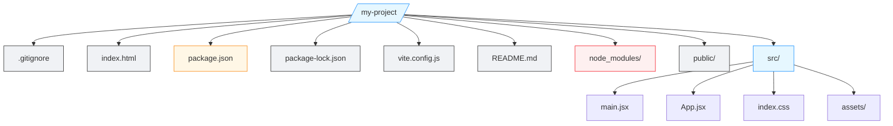
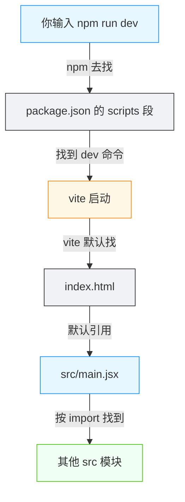

# 一个项目为什么长这样

<div align="center">

**项目里的每个文件都有它该待的位置**

`src` · `tests` · `docs` · `config` · `package.json`

</div>

## 前言

> 💡 **场景重现**
>
> AI 对你说："我帮你创建好项目了，`cd` 进去看看"
>
> 你打开文件列表，突然多出几十个文件和文件夹，每一个名字都看不懂，也不敢删。"这些是干什么的？为什么长这样？"

这是整条主线上最常见的一幕：**创建项目**——AI 一条命令（比如 `npm create vite@latest`）就变出一整套目录结构。上一站你已经弄清楚了文件在电脑上是怎么组织的（路径、目录树）；这一站的第一篇，就来看一个**项目内部**的文件是怎么组织的：为什么会有 `src`、`tests`、`docs`、`config` 这些目录，哪些文件能动、哪些不能动，以及——为什么它非得长这样。

::: tip 💡 一句话记住项目结构
**项目结构**是一套"什么文件放哪里"的约定。每种文件都有它该待的位置，让任何人（包括未来的你）不用猜就能找到东西、知道改什么、不该动什么。
:::

## 一个典型的项目长什么样

假设你用 AI 创建了一个网页项目，它多半会长成下面这个样子（以最常见的 Vite + React 模板为例）：



一眼看上去很乱，但把每个角色弄清楚之后，这个结构其实非常工整。下面把每个成员过一遍。

### 根目录下的文件：项目的"门面"

| 文件 | 它是干什么的 | 你能动它吗 |
|------|-------------|-----------|
| `package.json` | 项目的**户口本 + 购物清单**：记录项目叫什么、依赖哪些第三方包、有哪些可用命令 | ⚠️ 要动，但要懂规则（见下文） |
| `index.html` | 网页的"入口文件"，浏览器加载的第一份文件 | 一般不用动 |
| `README.md` | 项目说明书：介绍项目是干嘛的、怎么安装怎么跑 | ✅ 可随意改 |
| `.gitignore` | 声明"哪些文件不进版本管理"（如 `node_modules/`、密钥） | ✅ 可改，但别乱删 |
| `vite.config.js` | 构建工具的配置文件：告诉 Vite 怎么打包 | 一般由 AI 改 |

### `src/`：源代码，项目的心脏

`src`（source 的缩写，即"源代码"）是**你（和 AI）真正会写的代码**所在的位置。这个项目里 `main.jsx` 是程序入口，`App.jsx` 是界面组件，`index.css` 是样式，`assets/` 放图片等静态素材。**几乎所有日常改动都发生在 `src/` 里。**

### `node_modules/`：装好的依赖，别碰

`npm install` 把第三方依赖下载到 `node_modules/` 文件夹里。这一层可能上万行代码，但**你不应该手动改动它**——它由 `package.json` 里的清单 + 包管理器自动生成，删了重装即可恢复。

### `public/`、`tests/`、`docs/`、`config/`：各司其职

模板里未必全都有，但项目变大后会逐渐出现这些目录：

- `public/`：不需要经过构建、原样发布出去的静态文件
- `tests/`（或 `test/`、`__tests__/`）：测试代码，用来"证明程序没写错"
- `docs/`：文档，说明"这个项目怎么用、怎么改"
- `config/`（或散落在根目录的 `*.config.js`）：配置文件，告诉工具"怎么跑、怎么打包"

::: tip 💡 现在在哪儿
**你现在正在读的这个教程站点，本身就是一个项目。** 它的源代码在 `vitepress/docs/` 下，配置在 `.vitepress/config.mts`，用 npm 管理依赖——你已经在用"看懂项目结构"的眼光看它了。
:::

## 为什么长这样：每个位置有它的职责

### 一张表看懂分工

| 位置 | 职责 | 你什么时候会碰它 |
|------|------|-----------------|
| `src/` | 源代码：这个项目真正要实现的逻辑 | 让 AI 改功能、加页面时 |
| `tests/` | 测试：验证代码行为符合预期 | 改完代码怕改坏时 |
| `docs/` | 文档：给人看的说明 | 想知道项目怎么用、怎么部署时 |
| 配置文件（`*.config.*`、`.gitignore`） | 配置：告诉工具怎么跑 | 需要调整构建、环境时 |
| `package.json` | 元数据 + 依赖清单 + 命令清单 | 装新依赖、换启动命令时 |
| `README.md` | 对外说明书 | 刚接手项目时第一个看它 |
| `node_modules/` | 已安装的依赖（生成物） | 正常情况下**不碰** |

### 背后的一句话：关注点分离

为什么把源代码、测试、文档、配置**分开放在不同目录**？因为它们的"读者"和"变更频率"不一样：

```mermaid
graph LR
    classDef u fill:#e6f7ff,stroke:#1890ff
    classDef t fill:#f0f2f5,stroke:#333
    classDef r fill:#f0fff4,stroke:#52c41a

    P[一个项目]:::t --> A[源代码 src/]:::u
    P --> B[测试 tests/]:::u
    P --> C[文档 docs/ + README]:::u
    P --> D[配置 config/]:::u
    P --> E[依赖清单 package.json]:::u

    A -->|给"运行的程序"看| R1[改动最频繁]:::r
    B -->|给"验证程序的人/工具"看| R2[改代码后跑一遍]:::r
    C -->|给"接手的人"看| R3[低频改动]:::r
    D -->|给"构建工具"看| R4[调环境时改]:::r
    E -->|给"包管理器"看| R5[装依赖时改]:::r
```

这种"把不同职责的文件分开"的设计原则叫**关注点分离**（Separation of Concerns）。它带来三个直接好处：

- **可预测**：找文件不用猜。想改界面去 `src/`，想装依赖去 `package.json`，想了解项目先看 `README.md`
- **可分工**：多人协作时各自负责各自的目录，互不干扰
- **可保护**：误删风险大的区域（`node_modules/`）和频繁改动的区域（`src/`）天然隔离

::: tip ⚠️ 说明
不是每个项目都有全部目录。小工具可能只有一两个文件，大型项目可能有几十个目录。但**"不同职责分开放"的原则不变**——这就是"为什么长这样"的答案。
:::

## 实战：看一个真实项目的结构

### 列出项目里的内容

```bash
# macOS / Linux
ls -la

# Windows PowerShell
Get-ChildItem
```

`-a`（Windows 为 `-Force`）会显示隐藏文件（以 `.` 开头，如 `.gitignore`）。你会看到上一节图里的那些成员。

### 用树状图看目录层级

`ls` 只能列出当前一层。要看整棵目录树，macOS / Linux 用 `tree`，Windows 用 `tree /F`：

```bash
# macOS / Linux（tree 未安装时用 brew install tree）
tree -L 2 -I node_modules

# Windows PowerShell
tree /F
```

`-L 2` 表示只展开两层，`-I node_modules` 表示跳过 `node_modules/`——否则输出会被成千上万的依赖文件淹没。

### 这套站点自己的结构

```bash
# macOS / Linux
tree -L 2 -I node_modules vitepress/docs

# Windows PowerShell
tree /F vitepress\docs
```

你会看到 `tutorial/` 下按"站"分目录：`00-roadmap/`、`01-project-startup/`、`02-project-understanding/`……每站一篇篇编号文档，顺序即学习顺序。**文档项目也是项目，结构约定一样成立。**

::: tip 💡 实战目标
跑通两条命令，能回答：这个项目的源代码在哪？配置文件在哪？依赖装在哪？——能答上来，"看懂项目结构"就入门了。
:::

## 原理简析：为什么工具"知道"去哪找文件

### 约定优于配置

`package.json` 为什么能驱动 `npm run dev`？`index.html` 为什么能被浏览器找到？`src/` 为什么就是源代码？答案是一个叫**约定优于配置**（Convention over Configuration）的原则：工具**默认**按一套固定的约定去找文件，不需要你额外告诉它：



每一步都**不需要你告诉工具"去哪个文件"**——工具按照约定自己去翻。这也解释了为什么**文件名和位置最好别乱改**：你把 `src/` 改名成 `codes/`，就得额外配置工具去新位置找，不然它就找不到源代码了。

### 变化频率决定放置位置

还有一个观察角度：**什么东西变化最快，越要放在显眼、好改的位置**。源代码天天改，放最显眼的 `src/`；`node_modules/` 是纯生成物，版本管理直接忽略它；文档变化慢，单独放 `docs/`。结构在相当程度上是"跟着改动频率和读者需求长出来的"。

::: tip ⚠️ 简化说明
真实的工程里还有测试覆盖率、CI 配置、环境变量文件等更多成员，细节因技术栈而异。本节的约定（npm 看 package.json、构建器找 index.html 与 src/）是贯穿绝大多数项目的主干，足够 vibecoding 使用。
:::

## 避坑指南

### 坑 1：手改 `node_modules/`

看到依赖文件想改两行？**不要。** 它由包管理器生成，下次 `npm install`（或换机器）就覆盖。要改第三方包的行为，正确姿势是找它的配置项，或另写一个包去包装它。

### 坑 2：乱动 `package.json` 的依赖清单

在 `package.json` 里手工加依赖、删依赖、改版本号，容易造成版本不一致（别忘上一篇「依赖」讲的坑）。**装依赖用包管理器命令**（`npm install xxx`），它会同时更新清单和 `node_modules/`，两边不会对不上。

### 坑 3：把代码放在约定之外的位置

把 `src/` 改名、把源代码堆在根目录，工具就可能找不到入口而报错。项目结构是给工具看的约定，**擅自改名 = 让工具"迷路"**。

### 坑 4：删掉 `.gitignore` 里的条目

`.gitignore` 声明了哪些文件不进版本管理。如果删掉其中 `node_modules/`、密钥文件等条目，这些大文件/敏感文件就会被提交进 Git——既拖慢仓库，又有泄露风险。**不确定的东西，先别从 `.gitignore` 里删。**

### 坑 5：不知道该备份/该提交哪些文件

记住一句话：**`node_modules/` 和构建产物不提交，源代码、配置、文档、依赖清单要提交。** 别人拿到你的仓库，跑一遍 `npm install` 就能重建出 `node_modules/`——所以它不需要（也不应该）进版本管理。

::: tip 💡 怎么快速验证"哪些该进 Git"
`.gitignore` 里列的就是"不该进 Git"的东西。看不懂就先让 AI 解释每一项，不要贸然删改。
:::

## 拓展阅读

### 配置文件会越来越多

项目变大后，配置文件会越来越多：`vite.config.js`、`tsconfig.json`、`.eslintrc`、`.env`……它们本质上都是"用声明的方式告诉工具怎么做"。下一站第二篇会专门展开 JSON、YAML、`.env` 这些配置格式——本篇只需先建立"配置文件有它自己的位置和规则"的直觉。

### 结构会随项目成长而演化

刚创建的项目结构简单，加功能、加测试、多人协作后逐渐长出 `tests/`、`docs/`、`config/`。**没有"唯一正确的结构"**，只要遵循"不同职责分开、工具约定的位置不动"这两条，结构是活的。

### 下一篇预告

项目里那堆 `*.json`、`*.yaml`、`.env` 文件，到底在说什么？为什么密码不能写进代码、而要放 `.env`？下一篇将讲解**配置文件**：`.json` `.yaml` `.env`。

## 📖 术语表

| 术语 | 一句话解释 |
|------|-----------|
| **项目结构 (Project Structure)** | 一套"什么文件放哪里"的组织约定 |
| **src** | source 的缩写，存放源代码的目录，改动最频繁 |
| **tests** | 存放测试代码的目录，用来验证程序行为 |
| **docs** | 存放文档的目录，说明项目怎么用、怎么改 |
| **config** | 存放配置文件的目录，告诉工具怎么跑、怎么打包 |
| **package.json** | 项目的元数据 + 依赖清单 + 命令清单，包管理器按它工作 |
| **package-lock.json** | 依赖清单的精确快照，锁定每个依赖的具体版本 |
| **node_modules** | 安装好的第三方依赖，由包管理器生成，不应手改 |
| **index.html** | 网页项目的入口文件，浏览器加载的第一份文件 |
| **README** | 项目说明书，通常是一个 `.md` 文档 |
| **.gitignore** | 声明哪些文件不进版本管理的清单文件 |
| **关注点分离 (Separation of Concerns)** | 把不同职责（代码/测试/文档/配置）分开组织的设计原则 |
| **约定优于配置 (Convention over Configuration)** | 工具按默认约定找文件，不需要逐项指定位置 |
| **构建 (Build)** | 把源代码转换成可发布产物的过程，涉及 `src/` 和配置文件 |
