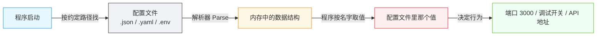

# 配置文件：.json .yaml .env

<div align="center">

**把"程序怎么跑"从代码里抽出来，写进单独的文件**

JSON · YAML · .env · 为什么密钥不进代码

</div>

## 前言

> 💡 **场景重现**
>
> AI 对你说："去改一下配置文件，把端口改成 8080"
>
> 你打开文件，里面是花括号、冒号加一堆缩进，看不太懂，更不敢改。"这是什么？改错了会不会弄坏项目？"

你也许已经注意到，一个项目里有不少以 `.json`、`.yaml`、`.env` 结尾的文件。上篇《项目结构》讲过，它们统称**配置文件**，告诉工具"怎么跑"。可它们为什么长得完全不一样？有的用花括号，有的靠缩进，有的只是几行 `名字=值`？为什么密码不能写进代码里，又该放在哪？

本篇把它们逐个拆开：JSON、YAML、`.env` 各自是什么、怎么写、用来干什么，最后回答那个最关键的问题——**为什么敏感信息不能进代码**。

::: tip 💡 一句话记住配置文件
**配置文件**（Configuration File）是独立于代码的一批"设置值"，程序启动时读进来，决定自己怎么运行。把设置从代码里抽出来，是工程实践的第一步。
:::

## 什么是配置文件

### 设置为什么不能写死在代码里

先想一个问题：一段代码写好了，如果换台机器、换个环境、想换个端口，就得改代码才能适配——每次改完都要重新发布，还可能顺手改错逻辑。

更好的做法是：把"哪些行为可以调整"的部分单独抽出来，放进一个文件。程序在**运行前读取**这个文件来决定行为。这个文件就是配置文件。改设置从此不用动代码，只改配置。

### 声明式：只描述"要什么"，不描述"怎么做"

配置文件与普通代码最大的区别是：代码是**指令**（告诉电脑一步一步怎么做），配置是**声明**（描述"我希望这样"，具体怎么做由程序自己决定）。

比如某配置文件里的一段：

```json
{
  "port": 3000
}
```

它没有写"请执行第 1 步、第 2 步"，只是声明了一个事实："端口是 3000"。读到它的程序自己决定怎么用这个值。这种写法叫**声明式**（Declarative）。

::: tip 💡 通俗类比
代码像菜谱：第一步倒油、第二步下锅……一步步照着做。
配置文件像点菜单：直接写"宫保鸡丁，微辣"，厨房（程序）自己知道怎么做。
:::

### 配置格式为什么有好几种

JSON、YAML、`.env` 本质在做同一件事：**用文本存一批"名字 = 值"（或更复杂的结构）**。区别在于语法不同、擅长场景不同：

- **JSON**：机器最友好，几乎所有语言都有解析库，但写起来啰嗦
- **YAML**：人最友好，适合手写长配置，但靠缩进表达层级，容易出错
- **.env**：最简单，就是一行行的键值对，专门给环境变量用

::: tip ⚠️ 粒度区别
上上篇「环境变量」讲的"环境变量"是**进程级**的全局设置；本篇的配置文件是**项目级**的：它跟着项目走，放进仓库，告诉工具"这个项目怎么跑"。`.env` 则是两者的交叠——它把"这个项目的环境变量"写成一个文件。
:::

## JSON：机器最友好的配置格式

### 什么是 JSON

**JSON**（JavaScript Object Notation，即"JavaScript 对象标记法"，一种通用的数据文本格式）把数据写成"键值对"和"列表"的组合：

- 花括号 `{}` 表示一个**对象**（Object，一组键值对的集合）
- 方括号 `[]` 表示一个**数组**（Array，一组有序的值）

一个典型的 JSON 配置长这样：

```json
{
  "name": "my-project",
  "version": "1.0.0",
  "port": 3000,
  "debug": false,
  "features": ["search", "theme"],
  "author": {
    "name": "Alice",
    "email": "alice@example.com"
  }
}
```

JSON 的语法规则很少，记住几条就不会写错：

- 键和字符串值都必须用**双引号**包裹
- 键与值之间用冒号 `:`，条目之间用逗号 `,`
- 值可以是字符串、数字、布尔值（`true` / `false`）、空值（`null`）、数组、另一个对象
- **不支持注释**，末尾**不能有多余逗号**

### 为什么 JSON 到处都在用

- **生态最广**：几乎所有编程语言都内置 JSON 的解析库，天然跨语言
- **格式严格**：机器解析可靠，语法错了会直接报错，不容易"猜错"
- **结构清晰**：可以表达嵌套的复杂结构，适合存"配置对象"

项目里最常见的两个 JSON 配置：`package.json`（项目的元数据与依赖清单）和 `tsconfig.json`（TypeScript 编译选项）。上篇已经介绍过 `package.json` 的职责，本篇关注的是它的"样子"——它就是一个 JSON 对象，键是 `name`、`scripts`、`dependencies` 等，值是字符串、数组或对象。

::: tip 💡 怎么判断一个文件是不是 JSON
看开头是不是 `{` 或 `[`，键是不是带双引号。`.json` 结尾的文件几乎都是。
:::

## YAML：人最友好的配置格式

### 什么是 YAML

**YAML**（YAML Ain't Markup Language，意为"YAML 不是标记语言"，一种以缩进表达层级的数据文本格式）同样用来存数据，但它把"给人看"放在第一位：层级关系靠**缩进**表达，而不是花括号。

同一份配置，JSON 写法：

```json
{
  "server": {
    "port": 3000,
    "host": "localhost"
  },
  "features": ["search", "theme"]
}
```

YAML 写法：

```yaml
server:
  port: 3000
  host: localhost
features:
  - search
  - theme
```

对比一下：YAML 更短、更像"人写的清单"。缩进多一层，就表示嵌套深一层；数组用 `- ` 开头列出。

### YAML 的几条规则

- 层级用**空格缩进**表示，同一层必须缩进一致（通常用两个空格）
- 键值对用 `键: 值`，冒号后要有一个空格
- 数组项以 `- ` 开头
- **支持注释**（`#` 开头），写复杂配置时可以随手加说明
- 语法严格：不能用 Tab 缩进，缩进错乱会解析失败

::: warning ⚠️ 一句话记住 YAML 的坑
YAML 里**只能用空格缩进，不能用 Tab**。一混入 Tab，解析器就分不清层级，直接报错。
:::

### YAML 和 JSON 什么关系

YAML 是 JSON 的**超集**：任何 JSON 都是合法的 YAML。反过来不成立——YAML 支持注释、更宽松的写法，JSON 不认识。所以"JSON 能表达的，YAML 都能表达"，只是 YAML 更费心在"人"这边。

### 哪里最常见 YAML

手写的、偏"声明式"的配置偏爱 YAML，例如：

- `docker-compose.yml`：编排容器服务
- GitHub Actions 的工作流文件（`.github/workflows/*.yml`）
- 各类 CI/CD 工具的流水线定义

这类配置通常由**人来维护**、结构较深，YAML 的可读性优势正好发挥。

::: tip 💡 不用背
你不需要记住每种工具用什么格式。只要理解"JSON 机器友好、YAML 人友好、都能表达嵌套结构"，看到 `.yml` / `.yaml` 时知道它是配置文件即可。
:::

## .env：给项目用的环境变量清单

### 什么是 .env

`.env` 是项目根目录下一个**极简格式**的文件：每行一条 `名字=值`，内容就是这个项目私有的"环境变量清单"。

```text
# 项目根目录的 .env 文件
API_KEY=sk-xxxxxxxx
PORT=3000
DATABASE_URL=postgres://localhost:5432/mydb
```

它和 JSON / YAML 完全不同：**没有花括号、没有缩进、不支持复杂嵌套**，就是键值对的平铺。程序运行前，由工具（Node 生态常用 `dotenv`）读入，注入为进程的环境变量，程序里照常通过环境变量接口读取。

::: tip 💡 通俗类比
全局环境变量是系统的"固定菜单"，每桌客人（每个程序）都抄一份；`.env` 是**这个项目自己写的一张菜谱备注**：这桌客人额外要求"少放盐、多放辣"，只对这桌生效，不打扰别人。
:::

### 为什么要有 .env

- **项目自包含**：每个项目带一份自己的配置，不污染系统全局设置
- **环境可切换**：开发、测试、线上各自一份 `.env`，切换环境就是切换文件
- **敏感信息集中管理**：密钥、口令、连接串都集中在这一处，方便审查与隔离

### .env 不进版本管理

`.env` 里常有密钥等敏感信息，因此它**默认不进版本管理**（Git，后续章节会细讲）。项目在 `.gitignore`（声明"哪些文件不进版本管理"的清单）里写上 `.env`，它就不会被提交、不会被共享。

```text
# .gitignore 中常见的一行
.env
```

::: warning ⚠️ 别提交 .env
`.env` 一旦提交进仓库，就等于把密钥公开给了所有能拿到仓库的人。正确姿势是：`.env` 加进 `.gitignore`，另留一份**不含真实值**的 `.env.example`（模板，列出需要哪些键）进仓库，让拿到项目的人照着复制、填自己的值。
:::

### 三种格式对比

| 维度 | JSON | YAML | .env |
|------|------|------|------|
| 文件扩展名 | `.json` | `.yml` / `.yaml` | `.env` |
| 结构能力 | 强（对象、数组、嵌套） | 强（同 JSON） | 弱（仅键值对） |
| 注释 | 不支持 | 支持（`#`） | 支持（`#`） |
| 谁在写它 | 工具 / 程序 | 人 | 人（通常配密钥） |
| 典型用途 | `package.json`、`tsconfig.json` | CI 流水线、`docker-compose.yml` | API 密钥、端口、连接串 |

::: tip 💡 选择口诀
**机器生成的配置用 JSON，人维护的声明用 YAML，放密钥和运行差异用 .env。** 三者不冲突，一个项目往往三种都有。
:::

## 为什么密码不能写进代码里

这是本篇最实际的一问。很多新手被 AI 要求"写进配置文件"时会想：直接写在代码里多省事？原因如下。

### 代码是会"到处跑"的

代码不是躺在你电脑上的私人物品：它会被提交进版本管理、推到远程仓库、可能开源、备份、发给同事、在 CI 上执行、部署到多台服务器。**代码的传播范围远大于你的预期**。任何写进代码的密钥，都会跟着它一起传播。

### Git 历史删不掉

就算你发现后立刻删掉那行密码并重新提交，它仍然**永久留在 Git 的历史记录里**。任何人克隆仓库、翻看历史提交，都能把曾经的密钥翻出来。所以"事后删掉"并不能挽回泄露。

### 有人专门在扫描密钥

GitHub 等平台上爬虫会**自动扫描公开仓库里的密钥**（识别 `sk-`、`password`、`token` 等模式），找到就立刻拿来薅你的账号额度、发垃圾邮件、控制你的资源。你的密钥可能在被删之前就已被利用。

### 正确姿势

- **密钥放 `.env`**：写进 `.env`，加进 `.gitignore`，不进仓库
- **代码里只引用名字**：代码写 `process.env.API_KEY`（取环境变量），而不是 `"sk-xxx"` 本身
- **怀疑泄露就轮换**：一旦觉得某个密钥可能泄露出去了，立即在服务商后台**重新生成（轮换）**——这比试图删记录可靠得多
- **更严密的场景**：大型项目用专门的**密钥管理服务**（如云厂商的 Secrets Manager、Vault）集中保管，不在本地明文出现

::: tip 💡 一句话原则
**代码里不放秘密，秘密放进不进仓库的文件，通过环境变量的方式喂给程序。** 这样代码可以放心公开，秘密仍只在你手里。
:::

## 实战：亲手读写一个配置文件

### 1. 写一个 JSON 配置并验证

在任意目录建一个文件 `app-config.json`：

```json
{
  "appName": "my-app",
  "port": 8080,
  "debug": false
}
```

JSON 的合法性可以交给工具验证。macOS / Linux 用 Python 的 JSON 解析器（或 `node -e`），Windows 用 Node.js：

```bash
# macOS / Linux（任选其一）
python3 -m json.tool app-config.json
node -e "JSON.parse(require('fs').readFileSync('app-config.json')); console.log('JSON OK')"

# Windows PowerShell
node -e "JSON.parse(require('fs').readFileSync('app-config.json')); console.log('JSON OK')"
```

能正常输出 `JSON OK` 说明格式合法。现在故意在末尾多加一个逗号，再跑一次——会得到解析报错。这就是"格式严格"的体现。

::: tip 💡 试试看
把末尾 `"debug": false` 改成 `"debug": false,`（多了个逗号），再跑上面的命令，观察报错。改回来，就恢复正常。
:::

### 2. 写一个 YAML 配置

没有 YAML 解析器也没关系，这个例子只是为了"看着写"：

```yaml
# app-config.yml
app:
  name: my-app
  port: 8080
services:
  - web
  - api
```

::: warning ⚠️ 缩进对齐
YAML 里 `app:` 和 `services:` 必须对齐（缩进相同），`name:` 和 `port:` 必须对齐。用空格、别用 Tab。
:::

### 3. 建一个 .env 并加进 .gitignore

```text
# .env（示例，真实文件里填你自己的值）
API_KEY=sk-change-me
PORT=3000
```

如果项目里已经有 `.gitignore`，在末尾加一行：

```text
.env
```

这样 `.env` 就不会被提交进版本管理。另建一个 `.env.example`，里面放键名、值留空或写占位符，这个文件可以提交：

```text
# .env.example（提交进仓库，不包含真实密钥）
API_KEY=your-api-key-here
PORT=3000
```

::: tip 💡 实战目标
做完三步，你能：① 用工具验证 JSON 是否合法；② 知道 YAML 靠缩进表达层级；③ 让 `.env` 不进版本管理。这三点覆盖了日常 90% 的配置文件操作。
:::

## 原理简析：程序是怎么读到配置的

配置不是魔法，读取过程分三步：

1. **定位**：程序启动时，按约定路径找配置文件（如"项目根目录的 `package.json`"）
2. **解析**（Parse）：把文本内容按格式语法解析成内存中的数据结构（对象 / 数组 / 键值对）
3. **引用**：程序运行时，从这份数据结构里取需要的值



这也解释了两种常见报错：

- **格式错误**：解析阶段就失败，程序直接报"配置文件语法错误"——往往是 JSON 多逗号、YAML 混入 Tab
- **取值错误**：解析成功但某个值不是预期格式，程序运行时才报错——比如端口被写成 `"abc"`

::: tip ⚠️ 简化说明
真实的配置读取还包括环境变量覆盖（同名时以谁为准）、默认值合并等细节。先记住"定位 → 解析 → 引用"三步，遇到配置报错就知道去哪一步排查。
:::

## 避坑指南

### 坑 1：JSON 多一个逗号 / 少一对引号

JSON 最经典的报错来自：末尾多逗号、键忘了加双引号。写完后用 `python3 -m json.tool`（macOS / Linux）或 Node 的 `JSON.parse` 验证一遍，比肉眼检查可靠。

### 坑 2：YAML 用了 Tab 缩进

YAML 只认空格。编辑器里 Tab 常被渲染成空格、看起来对齐了，但解析器不认。报"解析错误"时，优先检查有没有混入 Tab。多数编辑器右下角能切换"显示空白字符"来排查。

### 坑 3：把 `.env` 提交进仓库

`.env` 里是密钥，提交进去就相当于把钥匙挂在大门口。每次拿到新项目，先看 `.gitignore` 里有没有 `.env`；没有就加上，再确认 `git status` 里没有可疑文件。

### 坑 4：把密钥硬编码进代码

就算项目是私有的，代码也会进 Git 历史、上 CI、部署到多台机器。把密钥写进代码意味着它迟早出现在不该出现的地方。正确做法见前文"正确姿势"。

::: tip 💡 判断原则
问自己一句：**这个文件会不会被提交 / 共享 / 备份？** 会，就别放秘密。放秘密的文件，必须是不进版本管理的那几个（`.env`、本地密钥文件等）。
:::

### 坑 5：把配置值和代码逻辑耦合

端口、开关、地址这类"运行时会变"的值，应放在配置文件里，而不是散落在代码各处。否则改一个设置要翻遍整个代码库，还容易漏改。**找设置，去配置文件；找逻辑，去代码**。

### 坑 6：混淆 `.env` 和 `.env.example`

`.env.example` 是给新人看的模板（无真实值，可提交），`.env` 是真实配置（有密钥，不提交）。复制项目时只复制 `.env.example` 再填值，别把别人的 `.env` 一起拷走。

## 拓展阅读

### 配置随着工程演进

小项目一个 `package.json` 就够；项目长大后配置会越来越多（`tsconfig.json`、CI 文件、部署配置……）。它们遵循同一个原则：**把可变的部分从代码里抽出来**。看懂每个配置文件在"声明什么"，是接手任何项目的通用能力。

### 密钥管理的进阶

`.env` 是单机场景的密钥方案。到了多人、多环境、云上部署，密钥管理服务（如云厂商 Secrets Manager、HashiCorp Vault）会更严谨：密钥集中加密存储、按权限分发、支持轮换与审计，程序运行时动态取用，本地不落明文。入门阶段知道"有更严的方案"即可。

::: tip 🤔 思考一下
如果一个项目在 GitHub 上公开了，但 `.env` 加进了 `.gitignore`，别人拿到仓库能跑起来吗？——能，只要 README 或 `.env.example` 说明了需要哪些键、去哪里申请密钥。
:::

### 下一篇预告

配置文件决定了"程序怎么跑"，可真正让程序跑起来的是**运行时与进程**：你输入一条命令，操作系统里到底发生了什么？为什么一个项目要占用一个"端口"？下一篇将讲解「运行时与进程」——程序是怎么跑起来的。

## 📖 本章术语

| 术语 | 一句话解释 |
|------|-----------|
| **配置文件 (Configuration File)** | 独立于代码、程序启动时读取以决定行为的设置文件 |
| **声明式 (Declarative)** | 只描述"要什么"，不描述"怎么做"的写法 |
| **JSON** | JavaScript 对象标记法，一种以花括号/方括号表示数据结构的文本格式 |
| **对象 (Object)** | JSON 中 `{}` 包裹的一组键值对 |
| **数组 (Array)** | JSON 中 `[]` 包裹的一组有序值 |
| **键值对 (Key-Value Pair)** | 一个名字对应一个值的数据形式 |
| **YAML** | 以缩进表达层级的数据文本格式，JSON 的超集，适合人维护 |
| **.env** | 项目根目录下的环境变量清单文件，每行一条 `名字=值`，通常不进版本管理 |
| **.env.example** | `.env` 的模板文件，含键名不含真实值，可提交进仓库 |
| **.gitignore** | 声明哪些文件不进版本管理的清单文件 |
| **解析 (Parse)** | 把文本按语法读成内存中数据结构的动作 |
| **dotenv** | 读取 `.env` 文件并把其中键值对注入环境变量的工具（Node 生态） |
| **密钥 (Secret / Key)** | API 密钥、密码、令牌等敏感凭据，不应写进代码或提交进仓库 |
| **轮换 (Rotation)** | 怀疑密钥泄露后重新生成密钥以作废旧密钥的做法 |
