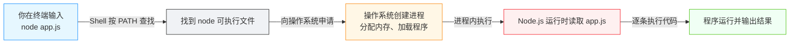
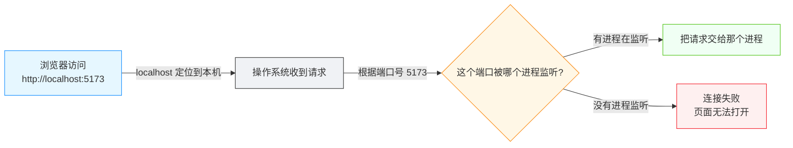
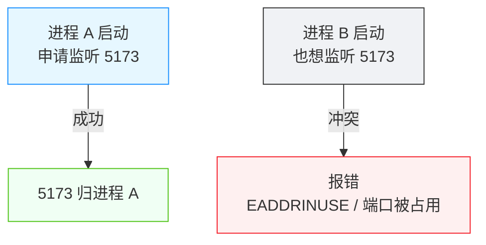

# 运行时与进程：程序是怎么跑起来的

<div align="center">

**命令为什么能启动程序，端口又是什么**

运行时 · 进程 · PID · 端口 · localhost

</div>

## 前言

> 💡 **场景重现**
>
> AI 对你说："执行 `npm run dev` 启动项目，然后浏览器打开 `http://localhost:5173` 看看"
>
> 你："`npm run dev` 之后发生了什么？为什么终端窗口被"占住"了？`localhost:5173` 里的 `5173` 是什么？"

上一篇「配置文件」讲到，配置文件决定了程序"怎么跑"。可真正让程序跑起来的，不是配置，而是**运行时**（Runtime）与**进程**（Process）。你输入一条命令，操作系统在背后创建了一个进程；开发服务器启动后，会监听一个**端口**（Port），等着浏览器来访问。

本篇就回答三个问题：程序代码是怎么变成"正在运行的程序"的？一条命令凭什么能启动程序？`localhost:5173` 里的端口号又是什么？

::: tip 💡 一句话记住本篇
**程序**（写在磁盘上的代码文件）是静止的；**进程**（Process，正在运行的程序）是活的。命令让操作系统**创建一个进程**来执行程序；提供网络服务的进程会**监听一个端口**，端口就是"这台机器上的门牌号"。
:::

## 程序文件 ≠ 正在运行的程序

### 1. 静止的程序文件

上一篇我们看到的 `.js`、`.py` 文件，本质都是磁盘上的**文本文件**。它们只是"代码的存档"，本身不会做任何事。

::: tip 🛵 打个比方
程序文件像一本**菜谱**：写得再详细，放在书架上也不会自己出菜。要真吃上菜，得有人（运行时）照着菜谱做一遍。程序文件要"活"起来，也得由运行时把它读进来、逐条执行。
:::

### 2. 进程：正在运行的程序

当代码被执行起来，操作系统就在内存中为它安排了一份"运行状态"，这份**正在运行的程序实例**就叫**进程**（Process）。同一个程序可以同时运行多次，每一次都是一个独立的进程：

- 你打开了两个终端，各运行一次 `node app.js` → 就有两个 Node.js 进程
- 两个进程各自拥有独立的内存空间，互不干扰

::: tip 💡 区分"程序"和"进程"
- **程序（Program）**：磁盘上的代码文件，静止
- **进程（Process）**：程序被加载执行后的运行实例，是"活"的，占用内存，有运行状态
:::

### 3. 进程的身份证：PID

每个进程在操作系统里都有一个**唯一的数字编号**，叫 **PID**（Process ID，即"进程编号"）。就像快递单号一样，凭 PID 可以精确地指认某一个进程——查看它、结束它。

::: tip 💡 为什么要知道 PID
后面排查"端口被占用""进程杀不掉"时，都要靠 PID 来指认目标进程。先记住：**每个进程 = 一个 PID**。
:::

## 运行时：谁在"执行"代码

### 1. 代码不能自己跑

CPU 只会执行机器指令，而 `.js`、`.py` 这些代码不是机器指令。中间需要一层"翻译官"把代码逐条解读成 CPU 能做的事，这层翻译官就是**运行时**（Runtime，即"运行环境"，负责执行代码的程序）。

不同语言有各自的运行时：

| 代码 | 运行时 | 怎么执行 |
|------|--------|---------|
| `.js`（命令行场景） | Node.js | 把 JS 读入并执行 |
| `.py` | Python 解释器 | 把 Python 读入并执行 |
| `.java` | JVM（Java 虚拟机） | 先把字节码载入，再执行 |
| `.js`（浏览器场景） | 浏览器内置的 JS 引擎 | 网页加载时执行 |

::: tip 💡 运行时就是"执行代码的那个程序"
在「环境」一篇里你已经见过 Node.js 这个名词。它就是 JavaScript 在浏览器之外的**运行时**：你运行 `node app.js`，实际上是让 Node.js 这个程序去读 `app.js` 并执行其中的代码。
:::

### 2. 运行时本身也是程序

容易绕的一个点是：**运行时自己也是一个程序**。它放在磁盘上，被命令启动后成为一个进程。所以"运行 `node app.js`"的完整含义是：

1. 命令启动 **Node.js 进程**
2. Node.js 这个运行时进程**读取 `app.js` 文件**
3. 运行时逐条执行代码，并处理错误、管理内存

::: tip 🤔 思考一下
既然运行时也是程序，那"谁在执行 Node.js 自己"？——是操作系统。运行时是普通程序，同样由操作系统创建进程来运行它。这个问题到此为止：你只需要知道"代码 → 运行时 → 操作系统"这三层的关系。
:::

## 🎯 实战：命令是怎么把程序启动起来的

### 启动一个程序

在终端里运行一条命令，背后发生的完整链条：

```bash
# macOS / Linux / Windows PowerShell 通用
node app.js        # 用 Node.js 运行时执行 app.js
```



::: tip 💡 认识关键词
- **Shell**：上一篇提到的命令解释器，负责解析你输入的命令
- **PATH**：Shell 按它去找命令对应的可执行文件（「命令结构」一篇讲过）
- 你不需要看到这些中间步骤——它们发生在瞬间，终端只会显示程序自己的输出
:::

### 查看正在运行的进程

```bash
# macOS / Linux
ps aux            # 列出当前所有进程
ps aux | grep node   # 只看和 node 相关的进程

# Windows PowerShell
Get-Process       # 列出当前所有进程
Get-Process node  # 只看名字含 node 的进程
```

输出里会有一串数字——那就是 PID。例如：

```text
user  1234  0.5  1.2  ...  node app.js
              ^^^^
              PID
```

::: tip 💡 只认名字，还是只认 PID？
进程名（如 `node`）可能对应多个进程；PID 才是唯一的。要精确操作某个进程，优先用它的 PID。
:::

### 结束一个进程

```bash
# macOS / Linux
kill 1234                  # 结束 PID 为 1234 的进程

# Windows PowerShell
Stop-Process -Id 1234      # 结束 PID 为 1234 的进程
```

::: warning ⚠️ 小心结束进程
`kill` 是无差别"终止信号"：进程来不及保存状态就直接退出。开发环境下可以放心用；但生产环境的服务进程，请先了解它对信号的处理（后面「日志」一篇会细讲）。
:::

## 端口：程序的门牌号

### 1. 为什么需要端口

电脑上同时运行着很多程序，浏览器请求来了，操作系统怎么知道该把数据交给谁？光靠"这台电脑"的地址不够——还需要区分**这台电脑上的哪个程序**。这个"程序编号"，就是**端口**（Port）。



::: tip 🛵 打个比方
一台电脑像一栋楼：**IP 地址**（如 `localhost`）是楼的门牌，**端口**是楼里的**房间号**。数据包像快递，只写到"某栋楼"还不够，得写到"某栋楼 ×× 号房间"，快递员才知道交给谁。
:::

### 2. 端口号：0 ~ 65535

端口号是 0 到 65535 之间的数字。有些端口有约定俗成的用途：

| 端口 | 常见用途 |
|------|---------|
| 80 | HTTP 网站（浏览器默认，访问网站时可省略 `:80`） |
| 443 | HTTPS 加密网站 |
| 3000 | React、Express 等开发服务器的常见默认端口 |
| 5173 / 5174 | Vite 开发服务器（`npm run dev` 常用） |

::: tip 💡 浏览器为什么能省略端口号
访问 `https://example.com` 时，浏览器默认帮你补上 443。写 `http://localhost:5173` 是因为 5173 不是默认端口，必须显式写出来。
:::

### 3. 监听：进程"占住"一个端口

一个提供网络服务的进程，会**监听**（Listen）某个端口——意思是"这个端口我承包了，请求都给我"。与此同时，**同一个端口在同一时刻只能被一个进程监听**。



这正是你经常看到的 `EADDRINUSE`（Address Already In Use，地址已被占用）报错的由来——**某个进程已经占住了这个端口**。

### 4. 查找谁占用了端口

开发中最常见的排查动作：哪个进程占用了 5173？

```bash
# macOS / Linux
lsof -i :5173          # 查看 5173 端口被谁占用，输出里有 PID

# Windows PowerShell
netstat -ano | findstr :5173   # 输出最后一列是 PID
Get-NetTCPConnection -LocalPort 5173
```

看到 PID 后，用上一节的 `kill` / `Stop-Process` 结束它即可。

::: tip 💡 常见场景
`npm run dev` 报 `EADDRINUSE: address already in use :::5173`，通常是**上次启动的开发服务器没关干净**。先 `lsof -i :5173` 找到 PID，再 `kill` 掉；或者改个端口重新启动（见避坑指南）。
:::

## 原理简析：为什么终端被"占住"了

### 1. 前台进程与后台进程

运行 `npm run dev` 后，终端窗口不再出现可输入的命令提示符，看起来像"卡住了"。其实它没坏——这是因为开发服务器是一个**前台进程**（Foreground Process，占据终端、持续输出日志的进程）。

- **前台进程**：占用终端，不断输出日志，直到你主动停止它
- **后台进程**：不占终端，命令立刻返回提示符，进程在背后继续跑

```mermaid
graph LR
    classDef u fill:#e6f7ff,stroke:#1890ff
    classDef t fill:#f0f2f5,stroke:#333
    classDef s fill:#fff7e6,stroke:#fa8c16
    classDef r fill:#f0fff4,stroke:#52c41a

    A[npm run dev]:::u --> B{进程运行中?}:::s
    B -->|是，持续输出日志| C[终端被"占住"<br/>不能再输入新命令]:::t
    B -->|按 Ctrl+C 停止| D[进程退出<br/>终端恢复输入]:::r
```

::: tip 💡 为什么 dev server 要占住终端
开发服务器要一直运行、随时响应浏览器请求，同时把报错和日志实时打给你看。占住终端是"我在干活"的体现。想继续用终端，就**另开一个窗口**。
:::

### 2. Ctrl+C：给进程发终止信号

在终端按下 `Ctrl+C`，不是"清空屏幕"，而是**向当前前台进程发送一个终止信号**（SIGINT），请它结束运行。这是日常停止 dev server 的标准操作。

::: tip 💡 区分几个概念
- **Ctrl+C**：中断当前前台进程（常用）
- **Ctrl+Z**：把进程挂起到后台暂停（不常用，容易被误解为退出）
- **关闭终端窗口**：前台进程通常随之结束，但被 `&` 放到后台的进程不一定结束
:::

## 避坑指南

### 坑 1：端口被占用（EADDRINUSE）

启动报 `EADDRINUSE` 是最常见的端口问题，多半是**上一个开发服务器没关干净**，或另一个项目也用了同端口。

```bash
# ① 找到占用端口的进程（macOS / Linux）
lsof -i :5173
# ② 结束它（PID 替换成 lsof 输出的数字）
kill <PID>

# Windows PowerShell
netstat -ano | findstr :5173   # 找到 PID
taskkill /PID <PID> /F          # 结束它
```

::: tip 💡 更省事的办法：换端口
Vite 等工具支持指定端口启动：`npm run dev -- --port 5174`。临时换个端口，比去查占用进程更快。不过这只是绕开问题——长期还要找到并结束真正的占用者。
:::

### 坑 2：浏览器打不开，但服务看起来在跑

输入 `http://localhost:5173` 打不开，可能原因依次排查：

1. 服务真的启动了？看终端有没有 `ready in ... ms` 之类的输出
2. 端口对不对？`npm run dev` 输出的地址是唯一的权威，别凭印象写
3. 端口被占用导致实际没起来？看有没有 `EADDRINUSE`

### 坑 3：以为终端"死机"了

`npm run dev` 占住终端是正常的。别急着强关窗口，先 `Ctrl+C` 正常停止；想继续敲命令就另开一个终端窗口。

### 坑 4：`Ctrl+C` 没效果

某些进程忽略了 `Ctrl+C` 信号（SIGINT），或者它是后台进程。这时用进程管理命令强制结束：

```bash
# macOS / Linux：找到 PID 后强杀
ps aux | grep node
kill -9 <PID>        # SIGKILL，强制终止

# Windows PowerShell
Get-Process node
Stop-Process -Id <PID> -Force
```

::: warning ⚠️ `kill -9` 是最后手段
`kill -9` 让进程没有机会保存状态、关闭文件，可能留下半截数据。只在普通 `kill`（SIGTERM）失效时使用。
:::

### 坑 5：改了代码却不生效

`npm run dev` 通常带**热更新**（HMR），改代码会自动刷新，不需要重启。但如果改了**配置文件**或**环境变量**（如 `.env`、端口），热更新不生效，**必须重启服务**：先 `Ctrl+C`，再重新 `npm run dev`。

::: tip 💡 快速判断
改代码不生效，先重启服务再观察。如果重启后仍然不生效，再去怀疑"改错文件"或"看错端口"。
:::

### 坑 6：把 `localhost` 当成公网地址

`localhost` 永远指向**你自己这台电脑**（回环地址 127.0.0.1），访问它不会经过网络、别人也访问不到。想让局域网或公网上的其他人访问你的开发服务器，用的是另一套地址和配置——那是「部署」篇章的内容。

## 拓展阅读

### 进程、端口与操作系统

本篇讲的进程、端口，都是**操作系统**在管理。想系统了解"操作系统管什么"（进程调度、内存、文件系统），可以读支线文章 `side-topics/operating-system.md`。端口、IP、网络协议背后的完整机制，属于网络通识，在「网页与数据」一站会用到它的一部分。

::: tip 💡 本篇讲了什么、没讲什么
本篇聚焦**你每天都会遇到的现象**：命令启动进程、dev server 占端口、端口被占用。至于进程内部怎么被调度、TCP 三次握手、IP 地址划分这些，先知道"有这回事"即可，不进入主线。
:::

### 下一篇预告

程序能跑起来了，可代码总在变——怎么把"现在这个能跑的状态"存下来？怎么在改坏了之后退回去？下一篇将进入 **Git 基础**：保存、回退、恢复，让项目的每一步都可撤销。

## 📖 本章术语

| 术语 | 一句话解释 |
|------|-----------|
| **程序 (Program)** | 磁盘上的代码文件，静止不动 |
| **进程 (Process)** | 正在运行的程序实例，占用内存、有运行状态 |
| **PID** | Process ID，每个进程的唯一数字编号 |
| **运行时 (Runtime)** | 负责执行代码的程序，如 Node.js、Python 解释器 |
| **Shell** | 命令解释器，解析并执行你输入的命令 |
| **端口 (Port)** | 网络地址上区分不同程序的"门牌号"，0~65535 |
| **监听 (Listen)** | 进程占用一个端口、等待请求到达的状态 |
| **localhost** | 指向本机自身的地址（回环地址 127.0.0.1） |
| **EADDRINUSE** | "地址已被占用"报错，端口被其他进程占用时的错误码 |
| **前台进程 (Foreground Process)** | 占据终端、持续输出、等待停止的进程 |
| **后台进程 (Background Process)** | 不占终端、在背后持续运行的进程 |
| **SIGINT / SIGTERM** | 终止信号，`Ctrl+C` 发送，请进程正常退出 |
| **SIGKILL** | 强制终止信号，`kill -9` 使用，进程无法处理 |
| **热更新 (HMR)** | 开发服务器检测到代码变化后自动刷新，无需重启 |
