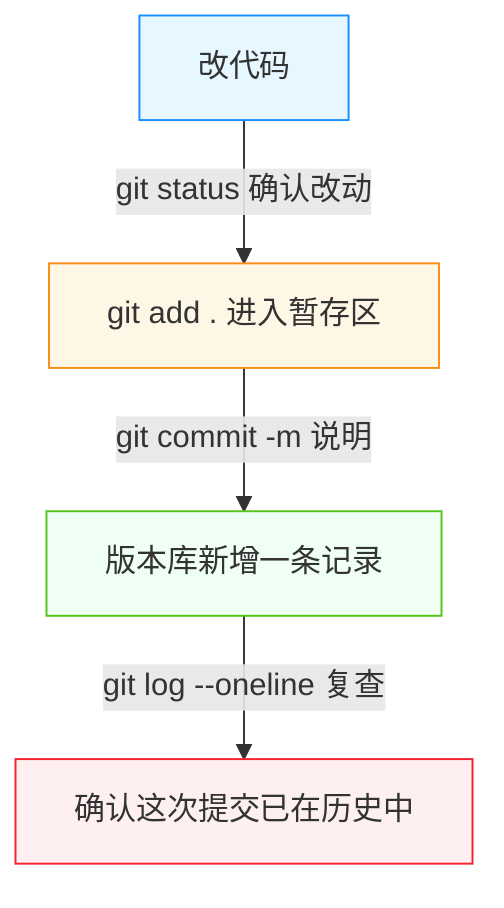
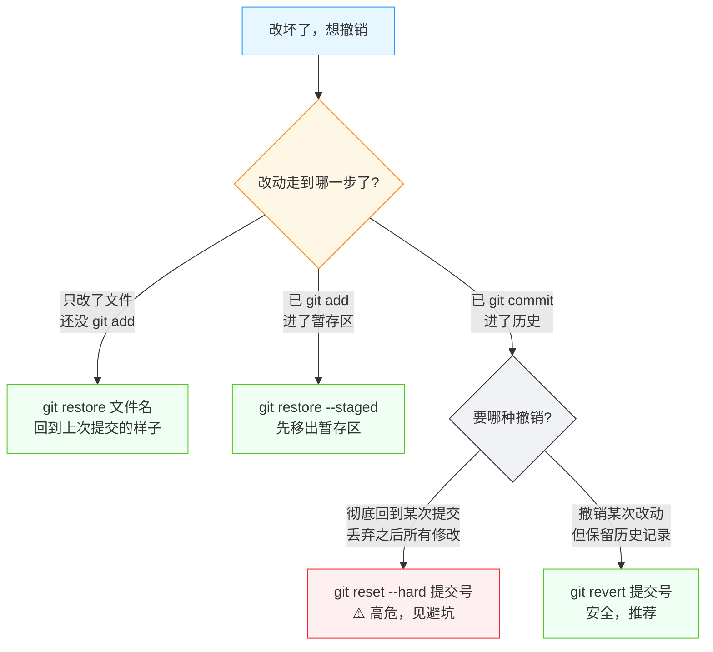
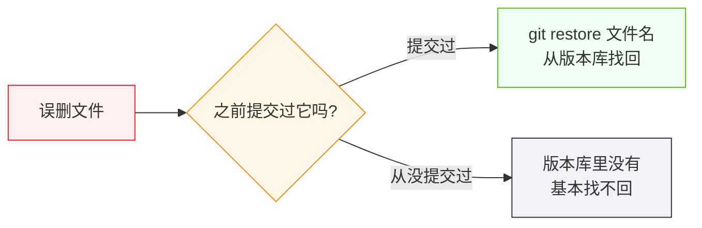
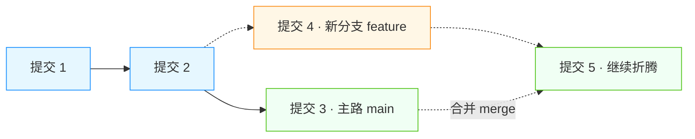

# Git 基础：保存、回退、恢复

<div align="center">

**项目的每一步都可撤销：版本管理到底在管什么**

Repository · Commit · 工作区 · 分支 · 回退

</div>

## 前言

> 💡 **场景重现**
>
> AI 对你说："先 `git add .` 提交一下，我刚才改坏了，`git reset --hard` 回去重来"
>
> 你："Git 是什么？`git add` 和提交是一回事吗？`reset --hard` 会不会把辛苦写的东西弄丢？"

上一篇「运行时与进程」讲到，代码靠运行时执行、靠进程跑起来。可项目不是一次性写成的——AI 会反复改代码，今天能跑的版本，明天可能就被改坏了。怎么把"现在这个能跑的状态"存下来？改坏了怎么退回去？误删了文件怎么找回来？

这些问题的答案都是 **Git**。它不只是"给代码拍快照"，更是你（以及 AI）每次动手改项目前的**保险绳**。本篇讲清楚它的核心机制：**保存**（提交）、**回退**（撤销）、**恢复**（找回），让你在 AI 反复折腾时心里有数，在它走偏时能人工接管。

::: tip 💡 一句话记住本篇
**Git** 是**版本管理系统**（Version Control System）：它给项目文件按时间拍快照，每个快照叫一次**提交**（Commit）。改坏了，就回到之前某个快照；误删了，就从快照里找回来。一句话——**项目里没有"不可撤销"的修改，只有"不知道如何撤销"的人**。
:::

## 为什么需要版本管理

### 1. 项目是"改出来的"，不是"一次写好的"

回顾整个主线：AI 创建项目、改配置、写功能、修报错……每一步都在**修改文件**。修改有风险：某次改动可能让项目崩掉；AI 反复尝试时，甚至可能连它自己都忘了之前哪一步能跑。

如果你只是"复制一份文件夹做备份"，会遇到三个麻烦：

- 备份散落一地：`final`、`final2`、`最终版`、`千万别删`……
- 备份之间没有差异记录：改了什么、为什么改，全靠记忆
- 备份的文件夹很大（含 `node_modules`），复制一次要等很久

::: tip 🛵 打个比方
手动备份文件夹，像往抽屉里乱塞纸：**每次都整叠复印**，不标日期不写说明，要用时翻半天。
Git 更像一台**带"时间戳"的复印机**：每次只记录"这次和上次差在哪"，并写上"谁、什么时候、为什么"。
:::

### 2. 版本管理的两个核心能力

版本管理系统要解决的就是两件事：

1. **保存**：随时把"当前这一份文件的状态"记录下来，并给这次记录配上说明
2. **恢复**：随时回到任意一次保存过的状态，无论是 5 分钟前还是 5 天前

所有 Git 命令，本质都在围绕这两件事转。先记住这个总目标，后面具体命令就不会散。

### 3. 为什么"人工接管"也要会 Git

在本站学习目标里，「保存、回退和恢复项目」是明确要求的能力。AI 操作 Git 时通常没问题，但它**卡住或走偏时**，你要能判断它做了什么、敢不敢让它继续：

- AI 说"我 `git reset --hard` 回退一下"——`--hard` 会**丢弃工作区的修改**，你真懂后果吗？
- AI 说"先提交一下再继续"——它到底保存了什么、没保存什么，你能看出来吗？
- 误删了文件，AI 不在，你敢自己把它找回吗？

本篇的实战部分，就是让你亲手掌握这三件事。**你不需要成为 Git 专家，但需要成为"看得懂 AI 在拿 Git 做什么、并能接管"的人。**

## Git 的三个区域：文件在"哪儿"决定了它会不会丢

### 1. 仓库：被 Git 管起来的那一整个目录

**仓库**（Repository，简称 repo）是被 Git 管理的一个项目目录。执行过一次 `git init`（初始化仓库），Git 就会在这个目录里建一个隐藏的 `.git` 文件夹，项目文件的**全部历史记录**都存在这里。

```bash
# macOS / Linux / Windows PowerShell 通用
git init        # 把当前目录变成 Git 仓库
```

`git init` 之后，这个目录及其子目录里的一切变更，Git 都能"看见"。第一次见到的 `.git` 文件夹不用怕——它就是 Git 的"账本"，平时别去动它。

::: tip 💡 怎么知道现在在不在仓库里
在任意目录执行 `git status`，如果它正常显示"当前分支、有没有改动"，说明这里是一个仓库（或仓库的子目录）；如果提示 `not a git repository`，说明不在仓库里——`git init` 一下即可。这一招排查"为什么 Git 命令不生效"特别有用。
:::

### 2. 三个区域：工作区、暂存区、版本库

文件在 Git 里会处于三种"位置"，理解这张图，后面所有命令都好懂：


- **工作区**（Working Directory）：你（和 AI）正在编辑、看到的那些文件。改动刚发生在这里，**此时还没被 Git 记住**
- **暂存区**（Staging Area，又称索引 Index）：一个"待提交清单"。你把想保存的改动 `git add` 进来，它们就进入这个区域，等着被正式记录
- **版本库**（Repository）：`.git` 里保存的**历史快照**。`git commit` 才会真正把暂存区的内容写进历史，形成一条永久的记录

::: tip 🛵 打个比方
把三区域想成**寄快递**：工作区是你在家打包的东西；`git add` 是把包裹送到快递站（暂存区）等着发货；`git commit` 才是真正发出、快递单上有了单号（版本库）。**只打包不发货，东西还是可能在"出门前"被弄丢；发了货，才算有了凭据。**
:::

### 3. 为什么会设计"暂存区"这一步

为什么不直接"改了就保存"？因为一次改动可能包含好几件不相干的事：修了一个 bug、顺手改了一行格式、加了一句注释。Git 允许你**挑挑拣拣**：只把某些文件放进暂存区，分别提交，历史记录就能保持清晰。

::: tip 🤔 思考一下
对初学者，暂存区常让人困惑："多此一举？"——它真正的价值在**精细控制**：`git add` 哪个文件，就保存哪个文件；其他改动可以留到下一轮。日常 vibecoding 里，AI 常用 `git add .`（`.` 表示"当前目录里所有改动"）一步全收，这没问题；但如果你想留一手，`git add <具体文件>` 更稳。
:::

## 🎯 实战：把"现在这个能跑的状态"存下来

Git 命令在 macOS / Linux 与 Windows PowerShell 下**完全一致**（它本身就是一套跨平台工具），本表列出同一命令的两栏写法以方便对照：

| 操作 | macOS / Linux | Windows PowerShell |
|------|--------------|-------------------|
| 查看哪些文件有改动 | `git status` | `git status` |
| 把一个文件放进暂存区 | `git add app.js` | `git add app.js` |
| 把当前目录所有改动放进去 | `git add .` | `git add .` |
| 提交（保存一个版本） | `git commit -m "说明"` | `git commit -m "说明"` |
| 查看提交历史 | `git log --oneline` | `git log --oneline` |
| 看具体改了哪些行 | `git diff` | `git diff` |

### 一次完整的"保存"流程

假设你刚让 AI 加好一个功能，项目能跑了。把它存下来：

```bash
# ① 看状态：有哪些改动
git status

# ② 把改动放进暂存区（想只存部分文件就换成具体文件名）
git add .

# ③ 提交：写一句"这次干了什么"，回车
git commit -m "feat: 添加登录功能"

# ④ 看历史：刚才的提交在里面了吗？
git log --oneline
```



### 读懂 `git status` 的输出

`git status` 是最常用的"体检报告"。它的输出里，红色/绿色区域分别告诉你：

- **未暂存的修改**（Changes not staged）：改了但还没 `git add`
- **已暂存的修改**（Changes to be committed）：已经 `git add`，等待 `git commit`
- **未跟踪的文件**（Untracked files）：新文件，Git 还没认识它

::: tip 💡 记住两个"还没有"
改动要真正进入历史，必须**经过两次确认**：先 `git add`（告诉 Git"我要保存这个"），再 `git commit`（告诉 Git"正式记下来"）。少任何一步，改动都**还没有**被保存——`git status` 会明明白白告诉你它停在哪一步。
:::

### `commit` 到底保存了什么

每次 `git commit`，版本库都会存下：**这次提交里所有文件的完整内容 + 提交说明 + 作者 + 时间**。每个提交有一个 40 位的十六进制编号（哈希），平时 `git log --oneline` 只显示前 7 位，够用。

```text
abc1234 feat: 添加登录功能
9876def fix: 修复端口冲突
5432abc docs: 更新说明
```

第一列就是提交编号，回退、恢复都要靠它指认目标。这串编号不好记没关系——**Git 不用你背**，你只需要知道去哪里看。

### 提交之后，一切才"可撤销"

记住一个分界线：**改动一旦 `commit`，就再也丢不掉了**（除非你用极其危险的方式硬删历史）。工作区里改了又没提交的东西，反而随时可能丢。后面的回退与恢复，全部建立在这个分界线上。

## 🎯 实战：改坏了怎么办（回退与恢复）

这是本篇的重点，也是「人工接管」能力的关键。按"改动走到哪一步了"分四种情况，先看决策图：



### 情况一：文件改了，但还没提交

只想扔掉某几个文件的修改，回到"上次提交"的样子：

```bash
# macOS / Linux / Windows PowerShell 通用
git restore app.js          # 丢弃 app.js 未提交的修改
git restore .               # 丢弃当前目录下所有未提交的修改
```

::: warning ⚠️ 无法找回
`git restore` 会**直接覆盖工作区文件**，被覆盖的未提交内容**无法找回**。执行前先确认：这次改动你确定不要了吗？想留一手的做法是：先 `git stash`（临时收起来）再决定，详见避坑指南。
:::

### 情况二：已经 `git add` 了，想撤回暂存

"加多了"或"加错了"，但改动本身想保留，只需把它**移出暂存区**：

```bash
git restore --staged app.js   # 把 app.js 移出暂存区，改动仍留在工作区
git restore --staged .        # 全部移出暂存区
```

::: tip 💡 旧写法也不用慌
老教程里你会看到 `git reset HEAD <file>`，作用和 `git restore --staged` 一样，都是"把文件从暂存区退回工作区"。Git 新版本推荐 `git restore`，两个命令目前都有效，别因为名字不同而困惑。
:::

### 情况三：已经提交了，想撤销一次提交

这是最需要分清场景的一步，选错命令后果完全不同：

| 目的 | 命令 | 效果 |
|------|------|------|
| 撤销最近一次提交，**但保留**它的改动 | `git reset --soft HEAD~1` | 提交被撤销，改动回到暂存区 |
| 撤销最近一次提交，改动回到工作区 | `git reset HEAD~1` | 提交被撤销，改动回到工作区 |
| 彻底回到某个提交，**丢弃**之后所有改动 | `git reset --hard <提交号>` | ⚠️ 之后的工作区改动和提交全丢 |
| 不删历史，追加一条"反向"提交来抵消它 | `git revert <提交号>` | ✅ 保留完整历史，最安全 |

- **`git reset`**：把"当前指针"拨回某个提交，**改写历史**（`HEAD~1` 表示"上一个提交"）
- **`git revert`**：针对某个提交**再产生一个新提交**来抵消它的改动，**不改写历史**，一路留下来的痕迹清清楚楚

::: warning ⚠️ `reset` 与 `revert` 怎么选
一句话原则：**自己本地、还没推给别人的改动**，用 `reset` 随便回；**已经推送（push）到远程、别人可能拉到的提交**，用 `revert`。`revert` 永远不亏，新手默认选它最稳妥。
:::

### 情况四：误删了文件，找回来

只要你删掉之前**提交过**这个文件，它就在版本库里躺得好好的：

```bash
# 从"上一次提交"找回误删的文件（改动丢，但文件回来了）
git restore 被删的文件名

# 从"某次提交"里恢复该文件的历史版本
git show <提交号>:被删的文件名 > 恢复出来的文件名
```



::: tip 💡 唯一找不回的情况
一个文件**从没被提交过**就删了，版本库里没有它的任何记录，基本找不回。这正是"经常 `git commit`"的理由——**你提交得越勤，能找回的东西越多**。
:::

## 分支：让 AI 的"试试看"不破坏主路

### 1. 为什么需要分支

AI 想做一个大改动，但它自己也没把握——万一改到一半崩了，主路（能跑的版本）就被污染了。**分支**（Branch）就是 Git 的"平行世界"：在某个提交上拉出另一条线，你在新线上随便折腾，主路不受影响。



### 2. 最小可用的分支命令

| 操作 | macOS / Linux | Windows PowerShell |
|------|--------------|-------------------|
| 查看当前在哪个分支 | `git branch` | `git branch` |
| 新建并切换到一个分支 | `git checkout -b 分支名` | `git checkout -b 分支名` |
| 切换回主分支 | `git checkout main` | `git checkout main` |
| 把分支合并回当前分支 | `git merge 分支名` | `git merge 分支名` |

```bash
git checkout -b experiment    # 从当前提交拉出新分支 experiment 并切过去
# …… 在这个分支里随便改，主路 main 毫发无损 ……
git checkout main             # 回到主路
git merge experiment          # 确认没问题后，把 experiment 合并回来
```

::: tip 💡 这才是本站真实的写照
你自己正在读的这份文档，就是在一条 `docs/xxx` 分支上写的：写坏了不影响 `main`，写好了再合并。这也是为什么"AI 让你先开分支再改"是个好习惯。
:::

### 3. 分支的深层内容，留给后面

分支合并时的**冲突**（Conflict，两处都改了同一段代码，Git 不知道该听谁的）、`pull` 时和远程的历史分叉，这些是踩坑高发区，但更贴近"协作与部署"——放在第五站「回滚」一篇展开。本篇你只需建立"**分支 = 平行世界，可以随便试**"的心智模型。

## .gitignore：哪些文件不该被保存

### 1. 不是所有文件都该进版本库

项目里有些文件**根本不该被提交**：

- `node_modules/`：第三方依赖，随时能靠 `npm install` 重新生成，又大又多
- `.env`：密钥、密码等敏感信息（「配置文件」一篇讲过它）
- 编译/构建产物：`dist`、`build` 等
- 系统或编辑器文件：`.DS_Store`、`Thumbs.db`、`.idea/`

`.gitignore` 文件就是一份"黑名单"：里面的规则 Git 会自动忽略，`git add .` 也不会把它们收进来。

```text
# node_modules/ 永远不要提交
node_modules/

# .env 含密钥，绝不提交
.env

# 构建产物
dist/

# macOS 系统文件
.DS_Store
```

### 2. 为什么这件事极其重要

一个项目会复制到多台机器、推给多个人。如果 `node_modules` 进了仓库，仓库会变得巨大、clone 极慢；如果 `.env` 进了仓库，**密钥就相当于公开了**——这是最严重的安全事故之一。

::: tip 💡 检查一下你的项目
打开项目根目录，通常已有 `.gitignore`（脚手架自动生成）。用 `git status` 确认：`node_modules` 和 `.env` **没有**出现在"未跟踪文件"里，就是对的。
:::

### 3. .gitignore 生效时机

`.gitignore` 只影响**尚未被跟踪**的文件。如果一个文件**已经**被提交过（已被跟踪），再往 `.gitignore` 里加它也不生效——必须先把已跟踪状态解除（`git rm --cached 文件名`），这个细节是高频踩坑点，见避坑指南。

## 远程仓库：把版本存到"别的地方"

### 1. 本地仓库的局限

到目前为止，所有版本历史都存在你电脑的 `.git` 里。问题是：**电脑会坏、文件会被清掉、别人也看不到你的项目**。把仓库复制一份到远程（比如 GitHub），就能解决备份和协作。

- **克隆**：`git clone <仓库地址>`，把远程仓库（含全部历史）完整复制到本地
- **推送**：`git push`，把本地新提交上传到远程
- **拉取**：`git pull`，把远程的新提交下载到本地

### 2. 主线上它出现的时机

主线里，推送和部署发生在项目要**上线**时：把代码推到远程，服务器再从远程拉取、构建、运行。届时还需要**密钥与权限**的配合（谁能推、谁能拉）。这些放到第五站「部署与维护」详细展开，本篇先认识三兄弟：`clone`（拿来）、`push`（送去）、`pull`（取回）。

::: tip 💡 你现在在读的文档就是这样流动的
你写的本地修改 → `git push` 到 GitHub → 合并进 `main` → 站点部署。版本管理把"写文档"这件事也变成了"可回退的工程"。
:::

## 避坑指南

### 坑 1：误删了文件，慌了

先冷静：只要删前**提交过**，就能找回来。

```bash
git restore 被删的文件名     # 从最近一次提交找回
git status                 # 确认：Git 会提示删除是否未提交
```

实在想不起文件名，`git log --oneline` 翻历史，`git show <提交号>` 看那个提交里都有什么文件。

### 坑 2：`git reset --hard` 把工作区"盖掉"了

这是最惨烈的误操作。`--hard` 会让工作区**完全等于**目标提交的样子，未提交的改动、之后的提交**全部丢弃**。

::: warning ⚠️ 动手前默念三遍
`reset --hard` 之前，先确认三件事：① 这是**本地、未推送**的改动；② 工作区没有你没提交的重要修改；③ 你要回的提交号没写错。**只要满足不了任何一条，就换 `git revert`。**
:::

万一已经执行了，还有一线生机：如果你记得之前提交号，`git reflog` 能列出 Git 的"操作流水账"，找到那串号再 `git reset --hard <旧号>` 能救回来一部分。但这是最后一招，别指望次次有效。

### 坑 3：把密钥、`.env` 提交进了仓库

这是**最严重**的事故：一旦推送，密钥就暴露了。补救：

1. 立刻把 `.env` 加进 `.gitignore`
2. `git rm --cached .env` 解除跟踪（保留本地文件）
3. 提交并推送这次修复
4. **同时**去平台（如 GitHub）**把密钥轮换掉**——已经公开过的密钥等于作废

::: warning ⚠️ 为什么必须轮换密钥
删除提交文件并不能抹掉历史：旧的提交里仍然躺着密钥，任何人翻历史都能看到。所以"从代码里删掉"只是第一步，"让密钥本身失效"才是真正的止损。
:::

### 坑 4：`.gitignore` 写了却不生效

几乎总是同一个原因：那个文件**之前已经被提交过**（已被跟踪），`.gitignore` 对已跟踪文件无效。

```bash
git rm --cached 文件名   # 解除跟踪，文件仍留在本地
git add .
git commit -m "chore: 停止跟踪 xxx"
```

从这以后，`.gitignore` 才对它生效。

### 坑 5：提交完才发现漏了文件 / 提交说明写错了

改动还**没推送**的话，`--amend` 可以把"补漏"合并进上一条提交：

```bash
git add 漏掉的文件
git commit --amend          # 把漏的文件并进上一条提交，还能改提交说明
```

::: warning ⚠️ 只对"还没推送"的提交用
已推送的提交别 `--amend`，会改写已公开的历史，别人 pull 时会很痛苦。已推送就老实再提交一次。
:::

### 坑 6：`git commit` 报错提示要配置用户

首次提交常见：Git 要求知道"你是谁"，用 `git config` 配置一次即可。

```bash
git config --global user.name "你的名字"
git config --global user.email "你的邮箱"
```

`--global` 表示"这台机器上的所有仓库都用这份身份"。配置好后重新提交。

### 坑 7：AI 反复让 `git reset --hard`，你心里没底

这是「人工接管」最典型的场景。AI 说"我 reset 一下重来"，你应该能立刻问它三句：

1. **要 reset 的是哪个提交？** 它确定这个版本是好的吗？
2. **工作区有没有没提交的改动？** `--hard` 会全丢，先 `git status` 确认
3. **这个提交推送到远程了吗？** 推了就别硬改历史，用 `revert`

::: tip 💡 安全的接管姿势
不确定时，先做两步：`git stash`（把当前未提交的改动临时收进保险箱）＋ `git branch 备份分支名`（给当前提交拉一条备份分支）。有这两步兜底，AI 怎么折腾你都能回来。
:::

## 拓展阅读

### 本篇讲了什么、没讲什么

本篇建立的是**单机、单人**的版本管理心智：保存、回退、恢复、分支、忽略文件。这些足够你跟上 AI 的日常操作并独立接管。

**没展开的**：合并冲突、`pull`/`push` 的历史分叉处理、`rebase`、远程协作权限、基于 Git 的部署与回滚——这些需要真实的多方协作场景才讲得透，放在**第五站「部署与维护」**（尤其 `04-rollback.md` 回滚篇）解决。想在主线外系统了解"Git 为什么这样设计"（对象模型、快照机制），可以后续读支线知识库补充。

### 与上一站的衔接

上一站你学会了"看懂一个项目长什么样、配置怎么改、程序怎么跑起来"。从本篇起，你开始具备**改变项目状态并把它保存下来**的能力——这恰好是「人工接管」清单里最核心的一条：**保存、回退和恢复项目**。

### 下一篇预告：第三站 · 网页与数据

项目能跑、能被保存、能回退，下一步就是让它"被人访问"：浏览器打开 `http://localhost:5173` 时，浏览器（客户端）和开发服务器（服务端）之间到底发生了什么？第三站「网页与数据」将从**客户端与服务端**开始，讲清 HTTP、API、数据存储——一条主线从"本机能跑"迈向"真的能用"。

## 📖 本章术语

| 术语 | 一句话解释 |
|------|-----------|
| **Git** | 版本管理系统，为项目文件按时间保存快照 |
| **版本管理 (Version Control)** | 记录文件每次变化、支持随时回到任一版本的技术 |
| **仓库 (Repository)** | 被 Git 管理的一个项目目录，含全部历史 |
| **工作区 (Working Directory)** | 你正在编辑的文件所在地，改动刚发生时在这 |
| **暂存区 (Staging Area)** | 等待提交的"待保存清单"，`git add` 后进入 |
| **提交 (Commit)** | 一次被正式记录的快照，有编号、说明、作者和时间 |
| **哈希 (Hash)** | 提交的唯一编号，`git log` 中可见 |
| **HEAD** | 当前所在位置的指针，`HEAD~1` 表示"上一个提交" |
| **分支 (Branch)** | 从某个提交拉出的平行开发线，互不干扰 |
| **合并 (Merge)** | 把某个分支的改动并入当前分支 |
| **`git init`** | 把当前目录变成 Git 仓库 |
| **`git status`** | 查看当前改动与文件状态 |
| **`git add`** | 把改动放入暂存区 |
| **`git commit`** | 把暂存区内容正式保存为一次提交 |
| **`git log`** | 查看提交历史 |
| **`git restore`** | 撤销工作区/暂存区的改动（未提交时用） |
| **`git reset`** | 把指针拨回某个提交，改写历史；`--hard` 会丢弃改动 |
| **`git revert`** | 用一次新提交抵消某次提交，不改写历史 |
| **`git stash`** | 把未提交的改动临时收起，随时可取回 |
| **`.gitignore`** | 声明哪些文件不被 Git 跟踪的黑名单 |
| **`git clone` / `push` / `pull`** | 复制远程仓库 / 上传提交 / 下载提交 |
