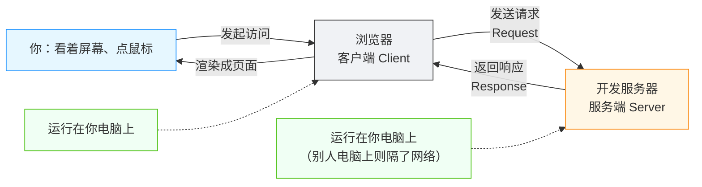
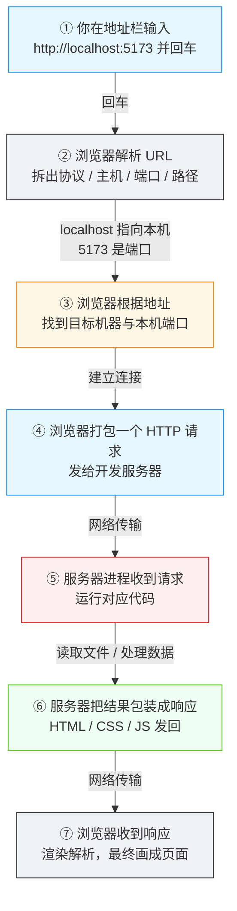

# 客户端与服务端：浏览器和服务器怎么分工协作

<div align="center">

**项目跑起来之后，浏览器里那扇"能看到东西的窗户"背后发生了什么**

客户端 · 服务端 · 请求 · 响应 · URL · localhost

</div>

## 前言

> 💡 **场景重现**
>
> AI 对你说："项目已经启动了，用浏览器打开 `http://localhost:5173` 看看效果。"
>
> 你："我点了地址栏、按了回车，网页就出来了。可到底是谁在干活？是浏览器吗？它从哪儿把网页拿来的？"

上一篇「Git 基础」解决了"项目状态怎么保存、改坏了怎么撤销"。但项目做得再好，不被人访问就没有意义。当你把 `http://localhost:5173` 敲进浏览器地址栏、按下回车的那一刻，一台电脑上的两个角色开始协作：**浏览器**（它是"客户端"）发起访问，**开发服务器**（它是"服务端"）提供内容。

本篇就回答三个问题：**客户端和服务端到底是什么？它们怎么分工？一次从浏览器到服务器的访问，中间经历了什么？**

::: tip 💡 一句话记住本篇
**客户端（Client）** 是发起请求的一方——就是你正在用的**浏览器**；**服务端（Server）** 是处理请求、提供内容的一方——就是运行在你电脑上的**开发服务器**。浏览器负责"把内容展示给你看"，服务器负责"把内容准备好给你"。双方靠**请求（Request）** 与**响应（Response）** 来回沟通。
:::

## 为什么需要"两个角色"：一台电脑也能开公司

### 1. 访问一个网站，天然是"一问一答"

在浏览器里打开任何网页，本质上都是一次**求助**：浏览器说"我想要这个页面"，服务器回答"给你"。没有服务器，浏览器就算再聪明，也不知道该把什么内容给你看——它不能凭空变出页面，只能展示**别人提供的**东西。

这一来一回，就形成了两个固定的角色：

| 角色 | 别名 | 谁 | 干什么 |
|------|------|-----|--------|
| **客户端 Client** | 前端 | 浏览器（以及其他"请求方"程序） | 发起访问、接收内容、渲染展示 |
| **服务端 Server** | 后端 | 开发服务器（以及各类"响应方"程序） | 接收请求、准备内容、返回结果 |

::: tip 💡 术语先给准的
**客户端**（Client，即"提出需求的一方"）与**服务端**（Server，即"提供服务的一方"）是相对的概念：谁**发起请求**，谁就是客户端；谁**处理请求并返回结果**，谁就是服务端。这个称呼不固定于某一台设备——同一个程序，在一种场景下可以是服务端，在另一种场景下也可以是客户端。
:::

::: tip 🛵 打个比方
把网页访问想成**在餐厅点餐**：你是客人（客户端），厨师在厨房（服务端）。你递上菜单（发请求），厨房做好菜端出来（返回响应）。你只负责"吃"（渲染展示），厨房负责"备料和烹饪"（处理逻辑与数据）。关键点在于：**菜不是你变的，是厨房给的**。
:::

### 2. 为什么不能"一台机器全干了"

有人会问：既然服务端只是"准备内容"，那让浏览器自己把内容都准备好不就行了？为什么非要分出两个角色？

因为有些事**只能**由服务端做，浏览器做不了、也不应该做：

- **内容要有"权威来源"**：网页想显示"当前库存还剩 3 件"，这个数字得有一个公认的出处。如果每个浏览器各自算，大家看到的就不是同一份数据了。
- **共享**：一个服务器准备一次内容，可以被**无数个**浏览器同时访问。数据只需要维护一份。
- **安全与权限**：密码校验、付款、删除数据这类操作，绝不能让浏览器"说了算"——浏览器运行在用户自己的电脑上，用户能随意改它。

::: tip 💡 为什么"全塞进浏览器"会出事
如果把"谁能删这条数据"的判断逻辑放在浏览器里，任何一个略懂技术的人都能打开浏览器的开发者工具，把"不允许"改成"允许"，直接把数据删掉。**凡是影响别人、影响持久数据、影响钱的逻辑，必须放在服务端**，因为服务端是"你自己可控的那台机器"。
:::

## 分工：浏览器负责什么，服务器负责什么

### 1. 浏览器（客户端）的活

浏览器不是"一个文件查看器"，而是一个**渲染引擎 + 交互平台**。它主要干三件事：

| 浏览器职责 | 具体表现 |
|-----------|---------|
| **发请求** | 用户输入网址或点击链接后，向服务器索要页面、图片、数据 |
| **渲染展示** | 把拿到的 HTML / CSS / JavaScript 变成你看到的页面（文字、颜色、布局、动画） |
| **收集与交互** | 响应你的点击、输入，把新指令再发给服务器（如提交表单） |

::: tip 🤔 思考一下
想想你平时用浏览器做的所有事——刷新闻、看视频、登录购物网站、聊天。所有这些场景里，浏览器都只是**展示方与发起方**，真正存数据、算库存、发消息的，都不是浏览器本身。
:::

### 2. 服务器（服务端）的活

服务器是"一直在那儿等着被访问"的程序。它的核心职责：

| 服务器职责 | 具体表现 |
|-----------|---------|
| **监听** | 一直占着一个端口（还记得「运行时与进程」里的 5173 吗），等待请求上门 |
| **处理逻辑** | 收到请求后，运行代码：查数据、算结果、做校验 |
| **返回内容** | 把结果包装成浏览器能读的格式发回去 |

::: tip 💡 "服务器"是个软件，不是那台铁疙瘩
日常说"服务器"，有时指**一台专门的电脑**（机房里的机器），有时指**一个提供服务的程序**（比如开发服务器）。在你的开发环境里，它指的就是 `npm run dev` 启动的那个程序——它运行在你自己的电脑上，但因为"提供服务"，所以叫**服务端**。它和"占了一台机房的电脑"是同一件事的两种规模。
:::

### 3. 一条简单的分工线

把上面的职责画一条线，这条线就是开发者常说的**前端 / 后端**分界：



::: tip 💡 前端 / 后端，其实指的就是这两个角色
- **前端（Frontend）**：用户直接接触的部分，即浏览器里渲染出的页面与交互。
- **后端（Backend）**：用户看不见的部分，即服务器上跑的逻辑、数据与接口。
它们说的就是客户端与服务端各自负责的领域，只是换了个更常用、更"岗位化"的叫法。
:::

## 🧩 底层揭秘：一次浏览器 → 服务器请求的完整链路

理解了分工，再看你按下回车键之后，到底发生了什么。下面是**一次访问的完整链路**——这是本篇要求你建立的核心心智模型：



::: tip 💡 一张图看懂这段链路
第 ①～④ 步是"**请求**"方向：从浏览器到服务器。第 ⑤～⑦ 步是"**响应**"方向：从服务器回到浏览器。整条链路里，**浏览器只负责发送与展示，服务器只负责接收与准备**——这就是客户端与服务端最根本的分工。
:::

### 关键步骤逐个看

**步骤 ②：URL 是什么**

你在地址栏输入的那串 `http://localhost:5173`，叫作 **URL**（Uniform Resource Locator，统一资源定位符），它是"某份资源在网上的地址"。可以拆成几部分：

| 部分 | 本例 | 作用 |
|------|------|------|
| 协议 | `http://` | 用什么"语言规则"沟通（HTTP 具体见下一篇） |
| 主机 | `localhost` | 目标机器是谁（本例指"本机"） |
| 端口 | `:5173` | 目标机器上的**哪个程序**（这个端口归开发服务器监听） |
| 路径 | `/`（可省略） | 要的是这个站点上的哪一份资源 |

::: tip 🛵 打个比方
URL 像一个**邮寄地址**：`http://` 是"寄信方式"（怎么寄），`localhost` 是"哪个城市哪栋楼"（哪台机器），`:5173` 是"几层几号房间"（哪个程序），`/` 是"要哪个信封里的哪一页"（哪份资源）。四样齐了，快递才能送到位。
:::

**步骤 ③：localhost 到底是什么**

`localhost` 是一个特殊的主机名，它永远指"**这台电脑自己**"。当浏览器看到 `localhost`，它知道：目标机器不在千里之外，就在眼前这台电脑上。这正是开发阶段服务器跑在本地、浏览器也从本地访问的原因。

::: tip 🤔 现在和以后的差别
开发时，客户端（浏览器）和服务端（开发服务器）跑在**同一台电脑**上，`localhost` 就够了。将来部署上线，服务端会跑到**另一台服务器**上，浏览器访问的就是那个真实域名（如 `https://example.com`）——到那时，第 ③ 步就要靠 **DNS**（把域名翻译成机器地址的系统）来找到目标了。这部分留到第五站「部署与维护」展开。
:::

**步骤 ④～⑥：请求与响应**

第 ④ 步，浏览器打包的"我要这个页面"的信息，叫**请求（Request）**；第 ⑥ 步，服务器回传的内容，叫**响应（Response）**。请求与响应是客户端与服务端之间唯一的沟通方式——它们具体长什么样、有哪些规则（这就是 **HTTP 协议**），是下一篇的主题，本篇只需记住"有来有回"这层关系。

::: warning ⚠️ 注意：以下内容简化了真实情况
真实的一次访问里，浏览器还会先做 DNS 解析、建立 TCP 连接、处理缓存，同一页面会连续发起几十个请求（页面、样式、脚本、图片各一个）。对 vibecoding 来说，掌握上面这条主干链路就足够，细枝末节等遇到具体报错时再查。
:::

## 🎯 实战：亲眼观察一次"有来有回"

理论讲完，动手看一次真实的请求与响应。下面两个方法任选其一，都会让你"看见"客户端与服务端之间的对话。

### 方法一：浏览器开发者工具（可视化）

1. 启动你的项目（`npm run dev`），在浏览器打开 `http://localhost:5173`
2. 打开开发者工具，切到 **Network（网络）** 面板（常用快捷键见下表）
3. **刷新页面**，观察面板里冒出来的每一行——那就是一次请求
4. 点开其中一行，能看到这次请求的"请求头"和"响应头"

| 操作系统 | 打开开发者工具的快捷键 |
|---------|----------------------|
| macOS | `Cmd + Option + I` |
| Windows / Linux | `Ctrl + Shift + I` |

::: tip 💡 第一眼该看什么
页面刷新后，Network 面板里通常最靠前的几行是 `document`（文档，即页面本体）和一堆 `js` / `css` / `img`。它们的**状态码**是 `200`（成功）。看到 `200` 就说明：请求发过去了，服务器也正常回了——这轮"有来有回"圆满成功。
:::

### 方法二：用终端命令（同样能看到）

浏览器之外，终端里也能发起请求。`curl`（客户端工具）就是一条最朴素的"假浏览器"：

| 操作 | macOS / Linux | Windows PowerShell |
|------|--------------|-------------------|
| 向本地开发服务器发起一次请求 | `curl http://localhost:5173` | `curl http://localhost:5173` |
| 只看响应的状态码 | `curl -I http://localhost:5173` | `curl.exe -I http://localhost:5173` |
| 把响应保存成文件 | `curl -o page.html http://localhost:5173` | `curl.exe -o page.html http://localhost:5173` |

```bash
# macOS / Linux
curl http://localhost:5173

# Windows PowerShell（Windows 的 curl 有时指向旧版别名，建议用 curl.exe）
curl.exe http://localhost:5173
```

执行后，终端会原样打印出服务器返回的 HTML——这就是浏览器**收到的那份响应内容**，只不过浏览器会把它画成页面，而终端只是把字吐给你看。

::: tip 💡 这一下你就明白了
对比一下：`curl` 拿到的是**同一份** HTML，但终端不渲染、只能显示源码。这正印证了分工——**"准备内容"是服务端的活，"把内容画出来"是客户端的活**。curl 只是个不画图的浏览器。
:::

## 避坑指南

### 坑 1：`localhost` 打不开——先分清"服务器没启动"还是"端口不对"

最常见的三连问："我明明启动了啊，怎么打不开？"排查顺序：

1. **服务器真的启动了吗？** 终端里有没有开发服务器仍在运行？没有就 `npm run dev` 重新启动
2. **端口对吗？** 项目默认端口不一定是 5173——启动日志里会写明，按日志里的地址访问
3. **是不是端口变了？** 5173 被占用时，Vite 会自动改用 5174、5175……，浏览器还敲 5173 当然打不开

::: tip 💡 判断"谁在报错"很重要
浏览器打不开，**先看是哪一边在说"不行"**：如果浏览器提示"无法访问此网站 / 无法连接"，通常是**服务端没起来**（或端口不对）；如果页面出来了、但某些功能不对，才轮到看**浏览器报错**与**服务器日志**。把问题归到正确的角色身上，是排错的第一步。
:::

### 坑 2：直接双击 HTML 文件打开，和通过服务器打开不一样

有时你会"偷懒"：不跑 `npm run dev`，直接双击项目里的 `index.html` 用浏览器打开（地址栏会变成 `file:///...`）。页面可能能显示，但常常**静悄悄地坏掉**：图片加载不了、功能报错。

原因在于：`file://` 模式没有"服务器"这个角色。凡是**需要服务端配合的功能**——请求接口、读取数据、受保护的资源——都会失效。**项目该用服务器跑，就用服务器跑**，这是 vibecoding 里最常见的隐蔽坑之一。

::: warning ⚠️ 判断口诀
看地址栏：以 `http://localhost`（或 `http://127.0.0.1`）开头，是走服务器的正常模式；以 `file://` 开头，是"跳过服务器"的裸文件模式——后者很多功能会莫名失效。
:::

### 坑 3：改完代码刷新还是旧页面——缓存

改了前端代码，刷新浏览器却还是老样子。常见原因有二：

1. **服务器没生效**：某些改动需要重启开发服务器（`Ctrl + C` 停掉，再 `npm run dev`）
2. **浏览器缓存**：浏览器把拿过的资源存了起来。可先 `Cmd + Shift + R`（macOS）/ `Ctrl + Shift + R`（Windows/Linux）**强制刷新**，绕开缓存

### 坑 4：把"客户端"和"服务端"记反

记性法：**谁主动开口，谁就是客户端**。浏览器永远主动开口（输入网址、点击链接），所以浏览器是客户端；服务器永远被动等着被访问，所以是服务端。哪怕服务器能力再强、跑的机器再大，只要它是"被请求"的那一方，它就叫服务端。

## 拓展阅读

### 本篇讲了什么、没讲什么

本篇建立的核心心智是：**浏览器（客户端）发请求、服务器（服务端）回响应，双方分工协作**。你现在应该能回答：客户端和服务端各自负责什么、URL 里每一段是什么、`localhost` 为什么指本机、一次访问的主干链路是什么。

**没展开的**：HTTP 请求与响应的具体格式与状态码（下一篇）、DNS 域名解析（第五站）、真正的服务器部署（第五站）、浏览器渲染的底层细节（支线）。这些都不需要现在掌握。

### 与上一篇（第二站）的衔接

上一篇「Git 基础」让你能把项目**保存、回退、恢复**。从本篇起，项目从"被我保存的代码"变成了"能被访问的服务"——你开始理解 `localhost:5173` 那扇窗户背后，浏览器和服务器是如何一问一答的。这也正是主线中"**浏览器访问**"现象对应的理论环节。

### 下一篇预告：HTTP

既然浏览器和服务器靠"请求 / 响应"沟通，那请求和响应**具体长什么样**？`200` 是什么？"404 页面"又是什么？下一篇将讲解 **HTTP**：浏览器和服务器之间用来"聊天"的规则与暗号。

## 📖 本章术语

| 术语 | 一句话解释 |
|------|-----------|
| **客户端 (Client)** | 发起请求、接收并展示内容的一方，日常就是浏览器 |
| **服务端 (Server)** | 接收请求、处理逻辑、返回内容的一方，开发时就是开发服务器程序 |
| **请求 (Request)** | 客户端发给服务器的"我要什么"的信息 |
| **响应 (Response)** | 服务器处理完请求后返回给客户端的"给你什么" |
| **URL** | 统一资源定位符，某份资源在网络上的完整地址 |
| **协议 (Protocol)** | 双方沟通时共同遵守的规则（如 `http://`） |
| **主机 (Host)** | 目标机器是谁（`localhost` 指本机） |
| **端口 (Port)** | 目标机器上"哪个程序"，同一端口同一时刻只能被一个进程监听 |
| **localhost** | 永远指向"本机"的特殊主机名 |
| **前端 (Frontend)** | 用户直接接触的部分，即浏览器里的页面与交互 |
| **后端 (Backend)** | 用户看不见的部分，即服务器上的逻辑、数据与接口 |
| **渲染 (Render)** | 浏览器把 HTML/CSS/JS 解析并画成可见页面的过程 |
| **DNS** | 把域名翻译成机器地址的系统（本篇仅提及，后续展开） |
